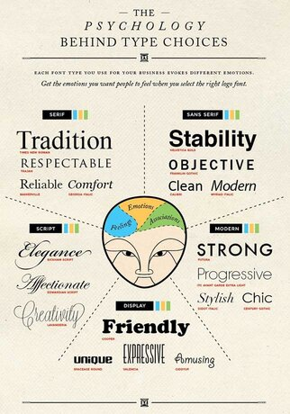
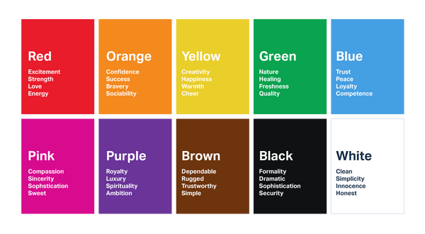

# Porfolio Website - ellenstafford.com

This website is an online porfolio, or resume, designed to showcase my skills and qualifications. It is also a great and intuitive way to learn more about me.

## Project Purpose 

The primary aim of this website is to establish an online presence for myself and to impress potential recruiters who may hire me. Unlike a traditional CV or resume, this online portfolio allows my skills to speak for themselves, with the website itself acting as an exemplar of my current skillset. By using HTML, CSS and a little Javascript, this website gives users an easy and aesthetically pleasing interface for them to effortlessly discover who I am. 

 ### Project Goals 
 
The goal of this site is to portray myself in the best possible light by advertising my skills and assets to potential employers/recruiters who may wish to hire me. The site also functions as a mechanism to showcase my skills, and does this by offering a unique and engaging user interface. The goal is to encourage traffic and increase my prospects in the career world, while also encouraging users to feel inspired; pleased and finally satisfied that their own goals have been met to a high standard. 
 
 ### Target Audience 

The main target audience for this website is recruiters and employers looking for someone to fulfil a role in software or web development. But the site is also open to audiences who simply want to know more about me. 

## User Experience (UX)

### User Stories 

-   #### First Time Visitor Goals     

    - As a first-time visitor, I want to understand the main purpose of the site immediately.
    - I want to easily navigate through the site's content. 
    - Similarly, I do not want to decode the site's features to be able to use them - no features should be hard to find or hard to perceive as a feature. 
    - I want to easily find information about the potential candidate I may hire. 
    - As a first-time visitor, I also want to immediately see the potential of the candidate, which means the site itself needs to meet a desired professional quality.
    - I want to be assured that the site is trusted, therefore I want to see social media links to serve as evidence to their major claims. 
    - Most significantly, as a first-time visitor, I want to *like* the site so that I will revisit it again. 
    
-  #### Returning Visitor Goals    

    - As a returning visitor, I want to see the projects the candidate may have worked on. 
    - Additionally, I want to see their qualifications, relevant work experience and what skills they have.
    - I want to be able to easily contact the candidate at any point throughout my navigation of the site so that they can answer any question I may have.
    - As a returning visitor, I may want to download a CV in PDF format and see references to validate the candidate’s claims.
    
-  #### Frequent Visitor Goals 

    - As a frequent user I want to check to see if the candidate has added any new features to their online portfolio.

## Design

### Typography 

I have imported [Poppins](https://fonts.google.com/specimen/Poppins?query=poppin) and [Josefin Sans](https://fonts.google.com/specimen/Josefin+Sans?query=jose) from [Google Fonts](https://fonts.google.com/), which have been consistently used throughout the site. Both fonts have Sans Serif as a fallback font incase the two fonts fail to import. 

- Poppins was used for the majority of the site's written text. It is a clean, readable font, making it both visually pleasing and appropriate.

  - As according to the image above regarding the psychology behind type choices, Poppins can be seen as combination of Sans Serif and Modern fonts. Therefore, the connotations and emotions associations with font include: clean, progressive, modern and reliable.

- Josefin Sans was used for the majority of the site's headers (h1-h6 elements), aswell as the navbar, navbar brand and the button on the homepage and the contact form. It is bolder than the Poppins font, which thus allows for a good visual contrast between titles and content. It also helps to distinguish particular sections from the whole body of the site. 

  - Josefin Sans can be seen as a hybrid between Serif, Sans Serif and Modern fonts. As according to the pyschology behind typography, Josefin Sans can evoke a combination of positive and associations emotions, such as: respectability, reliability, stability and strength.

### Colour Scheme

#### Colour Scheme - Psychology

The four main colours I have used on the site are cyan blue, white, a light pink and a soft violet. 

- White is a clean colour and is used often to create the illusion of space. In relation to web design, it visually declutters the site and reduces cognitive overload. The colour is associated with simplicity and honesty.
  
  - Dark UI's can be a risky choice for websites with text-heavy and/or data-heavy content. A porfolio website, by nature, is going to be fairly content-heavy. Therefore, I wanted to promote a light UI that was appropriate for the site's content. 
  
  - A white/light background with darker text on top is considered easier to read, making the colour choice even more suitable.

- The colour blue is symbolic of trust and reliability, which one of the intended responses I wanted from users visiting the site. As the site ultimately functions as an online representation of myself, this reaction is exactly what I want from users.

- I chose a light pink as a substitute of the colour red. While red can incite positive emotional responses, such as passion and energy, it can also trigger undesirable emotional responses, such as danger or urgency, which are not really appropriate reactions for my site. I considered pink to be a happy compromise, as it has that hint of red to suggest passion and energy, while being gentle enough as to not incite undesirable reactions. 

  - Pink has some positive emotional responses of its own, such as sophistication and sincerity.

  - The colour pink can also be an immediate indication to my gender.

- In comparison to the other colours, violet has been applied sparingly - used for buttons (i.e. the 'read more' buttons and project links) and title underlining with the hr element. The rule of three comes into play here - having *too many* colours shown *too often* could potentially cause cognitive overload for the user, and disrupt the site's consistency.

  - Violet goes well with both the pink and blue (red and blue make purple) and thus the three colours together provide a visual harmony.

  - Violet, like purple, can be associted with ambition, which is an appropriate portrayal of myself and thus appropriate for the website. 

#### Colour Scheme - Application

- #FFF White:
  - Navbar background colour
  - Jumbotron background colour on homepage 
  - Scroll Down arrow
  - Background colour for 'About Me', 'Projects' and 'Contact' pages and footer
  - 'Experience' page card's background color
  - Social media links
  - Font colour for coloured backgrounds

- #63C6D6E6 Cyan Blue:
  - 'About Me' and 'Experience' page background colour 
  - Homepage 'learn more' button and contact form 'send' button
  - Linear gradient in progress bars on 'Skills' page
  - Footer background
  - Background colour for project images
  - Scroll to top button
  - Navbar hover effects

- #FF3467D4 - Light Pink :
  - 'Skills' and 'Experience' page background colour

- #D678FD - Violet:
  - 'Hire me' button on 'About Me' page
  - Linear gradient in progress bars on 'Skills' page
  - 'Read more' collapse buttons, hr elements and project link buttons on 'Projects' page 
  - Hover tooltip for download CV button in footer

### Branding

I created a site brand using [Tailor Brands Studio](https://www.tailorbrands.com/) to make my site both unique and professional. I used visual imagery rather than just text to make the brand more recognisable and easier to remember - we are often quite visual by nature, so I believe this effect would work well. The design choice was not arbitray either, as it is a subtle indication to my personality and interests. I percieve the raven as symbolic of wisdom and intrigue, but they can also have deeply spirtual connotations. 

If I wish to create more projects in the future, such as a blog, for example, I can use this brand to indicate that it is of my creation -  like a signature or trademark.

To correlate with the branding, a raven has been implemented in the background image for the navbar's fullscreen-overlay menu when on mobile devices, to maintain a consistent theme throughout.

### Design Layout

Each page is split into half - depending on the screen size of your device this will either be a horizontal split for desktops and tablets, or a vertical split for mobile devices. For this I took a lot of inspiration from [this website](http://melaniedaveid.com/), but I tweaked it to make it my own. I felt the aesthetic was analogous to a book, which reflected my past devotion to literature and thus correlated well to the theme and purpose of the website.

## Technologies Used

### Languages 

- HTML (5)
- CSS (3)
- Javascript

### Frameworks, Libraries & Programs 

- [Bootstrap 4.4.1](https://getbootstrap.com/)
  - Bootstrap was used to aid with responsiveness and to form a foundation for styling the website.

- [JQuery](https://jquery.com/)
  - JQuery came with Bootstrap framework and was used to make the navbar responsive.
  
- [Google Fonts](https://fonts.google.com/)
  - Google fonts 

- [Font Awesome 5.14](https://fontawesome.com/)
  - Font Awesome  
  
- [Balsamiq](https://balsamiq.com/)
  - Balsamiq was used to create the wireframes during the design process.
  
- [Visual Studio Code](https://code.visualstudio.com/)
  - Visual Studio Code was the software used to write the code. 
  
- [Git](https://git-scm.com/)
  - Git was used for version control by utilising the PowerShell terminal in Visual Studio Code to commit to Git and push to GitHub.
  
- [GitHub](https://github.com/)
  - GitHub is used to store the projects code after being pushed to Git. It acts as a cloud-based service to store the project’s assets and code, which means we don't need to rely on saving locally alone. 
  
- [Tailor Brands Studio](https://www.tailorbrands.com/)
  - Tailor Brands Studio is a web-application that allows you create free brands and logos. It was used to create the logo which is displayed in the navbar. 

- [MockupBro: Free Online Product Mockup Generator](https://mockupbro.com/)
  - MockupBro is a web-application that allows you to create free mockup images. Mockups allow you to visually demonstrate what a product, or in this instance, a website will look like. I used some of their mockup images in the Projects section of my website. 

- [Smartmockups - Free Product Mockup Generator](https://smartmockups.com/)
  - Like MockupBro, Smartmocks is a web-application that allows you to create free mockup images. I also used some of their mockup images in the Projects section of my website. Using the two sites in conjunction allowed me to have more visual variety. 

- [PicResize - Crop, Resize, Edit images online](https://picresize.com/)
  - PicResize is a web-application that allows you to resize images and alter their width/height and pixel size. I used PicResize to make the carousel images a similar height and width
    in order to prevent the page jumping with each transition.

- [Asana](https://app.asana.com/0/home/1192103038725952)
  - Asana is a web and mobile application designed to help you organise, track and manage your projects. It was used to organise my project and schedule each task efficiently.

- [Responsively App](https://responsively.app/)
  - Responsively App is DevTool software that allows you to see an instant preview of all target screens for your website in a single window, side-by-side. It was used to check the responsiveness of my site.

- [W3C Validation Service](https://validator.w3.org/)
  - W3C Validation Service checks the markup validation of web documents. It was used to check my HTML file for errors.

- [W3C CSS Validation Service](https://jigsaw.w3.org/css-validator/)
  - W3C CSS Validation Service checks the markup validation of web documents. It was used to check my CSS file for errors.

## Testing 

Use W3C Mark-up 

### Testing User Stories

- #### First Time Visitor Goals 

- #### Returning Visitor Goals 

- #### Frequent Visitor Goals

### Further Testing 

### Known Bugs 

## Deployment 

## Credits 

### Code

### Content 

### Acknowledgements

