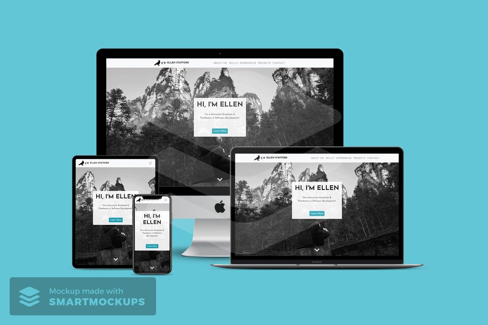
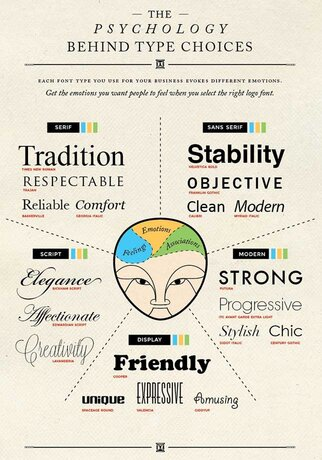
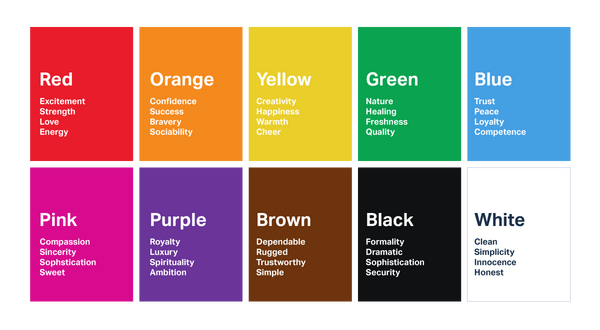
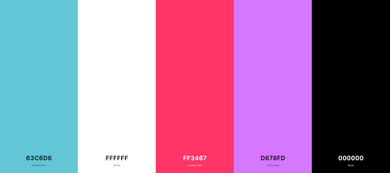

#  Porfolio Website: [ellenstafford.com](https://ellenst264.github.io/ellenstafford/)

[View live project here](https://ellenst264.github.io/ellenstafford/)

This website is an online porfolio, or resume, designed to showcase my skills and qualifications. It is also a great and intuitive way to learn more about me.



------

## Contents 


- [Project Purpose](#project-purpose)

- [User Experience (UX)](#user-experience-ux)

  - [User Stories](#user-stories)

- [Design](#design)

  - [Typography](#typography)

  - [Colour Scheme](#colour-scheme)

  - [Colour Scheme - Psychology](#colour-scheme-psychology)

  - [Colour Scheme - Application](#colour-scheme-application)

  - [Branding](#branding)

  - [Design Layout](#design-layout)

  - [Wireframes](#wireframes)

- [Features](#features)

  - [Implemented Features](#implemented-features)

  - [Features Left to Implement](#features-left-to-implement)

  - [Feature Feedback](#feature-feedback)

- [Areas of Improvement](#areas-of-improvement)

- [Accessibility](#accessibility)

- [Technologies Used](#technologies-used)

  - [Languages](#languages)

  - [Frameworks, Libraries and Programs](#frameworks-libraries-and-programs)

- [Testing](#testing)

- [Deployment](#deployment)

- [Credits](#credits)

  - [Code](#code)

  - [Content](#content)

  - [Inspiration](#inspiration)

  - [Acknowledgements](#acknowledgements)

-----

## Project Purpose 

The primary aim of this website is to establish an online presence for myself and to impress potential recruiters who may hire me. Unlike a traditional CV or resume, this online portfolio allows my skills to speak for themselves, with the website itself acting as an exemplar of my current skillset. By using HTML, CSS and a little Javascript, this website gives users an easy and aesthetically pleasing interface for them to effortlessly discover who I am. 

 ### Project Goals 
 
The goal of this site is to portray myself in the best possible light by advertising my skills and assets to potential employers/recruiters who may wish to hire me. The site also functions as a mechanism to showcase my skills, and does this by offering a unique and engaging user interface. The goal is to encourage traffic and increase my prospects in the career world, while also encouraging users to feel inspired; pleased and finally satisfied that their own goals have been met to a high standard. 
 
 ### Target Audience 

The main target audience for this website is recruiters and employers looking for someone to fulfil a role in software or web development. But the site is also open to audiences who simply want to know more about me. 

-----

## User Experience (UX)

### User Stories 

-   #### First Time Visitor Goals     

    - As a first-time visitor, I want to understand the main purpose of the site immediately.
    - I want to easily navigate through the site's content. 
    - Similarly, I do not want to decode the site's features to be able to use them - no features should be hard to find or hard to perceive as a feature. 
    - I want to easily find information about the potential candidate I may hire. 
    - As a first-time visitor, I also want to immediately see the potential of the candidate, which means the site itself needs to meet a desired professional quality.
    - I want to be assured that the site is trusted, therefore I want to see social media links to serve as evidence to their major claims. 
    - Most significantly, as a first-time visitor, I want to *like* the site so that I will revisit it again. 
    
-  #### Returning Visitor Goals    

    - As a returning visitor, I want to see the projects the candidate may have worked on. 
    - Additionally, I want to see their qualifications, relevant work experience and what skills they have.
    - I want to be able to easily contact the candidate at any point throughout my navigation of the site so that they can answer any questions I may have.
    - As a returning visitor, I may want to download a CV in PDF format and see references to validate the candidate’s claims.

-----

## Design

### Typography 



I have imported [Poppins](https://fonts.google.com/specimen/Poppins?query=poppin) and [Josefin Sans](https://fonts.google.com/specimen/Josefin+Sans?query=jose) from [Google Fonts](https://fonts.google.com/), which have been consistently used throughout the site. Both fonts have Sans Serif as a fallback font incase the two fonts fail to import. 

- Poppins was used for the majority of the site's written text. It is a clean, readable font, making it both visually pleasing and appropriate.

  - As according to the image above regarding the psychology behind type choices, Poppins can be seen as combination of Sans Serif and Modern fonts. Therefore, the connotations and emotions associated with the font include: clean, progressive, modern and reliable.

- Josefin Sans was used for the majority of the site's headers (h1-h6 elements), aswell as the navbar, navbar brand and the button on the homepage and contact form. It is bolder than the Poppins font, which thus allows for a good visual contrast between titles and content. It also helps to distinguish particular sections from the whole body of the site. 

  - Josefin Sans can be seen as a hybrid between Serif, Sans Serif and Modern fonts. As according to the pyschology behind typography, Josefin Sans can evoke a combination of positive associations and emotions, such as: respectability, reliability, stability and strength.


### Colour Scheme

#### Colour Scheme - Psychology



The four main colours I have used on the site are cyan blue, white, a light pink and violet. 

- White is a clean colour and is used often to create the illusion of space. In relation to web design, it visually declutters the site and reduces cognitive overload. The colour is associated with simplicity and honesty.
  
  - Dark UI's can be a risky choice for websites with text-heavy and/or data-heavy content. A porfolio website, by nature, is going to be fairly content-heavy. Therefore, I wanted to promote a light UI that was appropriate for the site's content. 
  
  - A white/light background with darker text on top is considered easier to read, making the colour choice even more suitable.

- The colour blue is symbolic of trust and reliability, which one of the intended responses I wanted from users visiting the site. As the site ultimately functions as an online representation of myself, this reaction is exactly what I want from users.

- I chose a light pink as a substitute of the colour red. While red can incite positive emotional responses, such as passion and energy, it can also trigger undesirable emotional responses, such as danger or urgency, which are not appropriate reactions for my site. I considered pink to be a happy compromise, as it has that hint of red to suggest passion and energy, while being gentle enough as to not incite undesirable reactions. 

  - Pink has some positive emotional responses of its own, such as sophistication and sincerity.

  - The colour pink can also be an immediate indication to my gender.

- In comparison to the other colours, violet has been applied sparingly - used for buttons (i.e. the 'read more' buttons and project links) and title underlining with the hr element. The rule of three comes into play here - having *too many* colours shown *too often* could potentially cause cognitive overload for the user, and disrupt the site's consistency.

  - Violet goes well with both the pink and blue (red and blue make purple) and thus the three colours together provide a visual harmony.

  - Violet, like purple, can be associted with ambition, which is an appropriate portrayal of myself and thus appropriate for the website. 

#### Colour Scheme - Application



- #FFF White:
  - Navbar background colour
  - Jumbotron background colour on homepage 
  - Scroll Down arrow
  - Background colour for About Me, Projects and Contact pages and footer
  - 'Experience' page card's background color
  - Social media links
  - Font colour for coloured backgrounds

- #63C6D6 Middle Blue:
  - About Me and Experience page background colour 
  - Homepage 'learn more' button and contact form 'send' button
  - Linear gradient in progress bars on Skills page
  - Footer background
  - Background colour for project images
  - Scroll to top button
  - Navbar hover effects

- #FF3467D4 - 'Radical Red' Pink :
  - Skills and Experience page background colour

- #D678FD - 'Heliotrope' Violet:
  - 'Hire me' button on About Me page
  - Linear gradient in progress bars on Skills page
  - 'Read more' collapse buttons, hr elements and project link buttons on Projects page 
  - Hover tooltip for download CV button in footer


### Branding


I created a site brand using [Tailor Brands Studio](https://www.tailorbrands.com/) to make my site both unique and professional. I used visual imagery rather than just text to make the brand more recognisable and easier to remember - we are often quite visual by nature, so I believe this effect would work well. The design choice was not arbitrar y either, as it is a subtle indication to my personality and interests. I percieve the raven as symbolic of wisdom and intrigue, but they can also have deeply spirtual connotations. 

If I wish to create more projects in the future, such as a blog, for example, I can use this brand to indicate that it is of my creation -  like a signature or trademark.

To correlate with the branding, a raven has been implemented in the background image for the navbar's fullscreen-overlay menu when on mobile devices to maintain a consistent theme throughout.


### Design Layout

Each page is split into half - depending on the screen size of your device this will either be a horizontal split for desktops and tablets, or a vertical split for mobile devices. For this I took a lot of inspiration from [this website](http://melaniedaveid.com/), but I tweaked it to make it my own. I felt the aesthetic was analogous to a book, which reflected my past devotion to literature and as the primary purpose of the website is for users to *read* and learn more about me, it thus correlated well to the site's theme and purpose.

Furthermore, the layout provides a distinct method of distinguishing titles from their content. This has been referred to in commit messages and syntax as the 'page chapters' and 'page content'.


-----

### Wireframes

All my wireframes were prepared in [Balsamiq](https://balsamiq.com/). Balsamiq allowed me to visualise the site's aesthetic before any of the code was created and helped with the construction of the surface plane. 

Each page has a wireframe for both desktop and mobile devices. I did not include a tablet wireframe in the design phase because I wanted the site to look nearly identical on tablet and desktop devices. Particularly as many laptops now can also function as a touchscreen tablet, I thought it was important that there were no stark differences between desktop and tablet as this may have compromised good UX design. 

The only difference between tablet and desktop is the collapsible navbar with the hamburger icon. However, as this alteration is represented in the mobile wireframe, I deemed it unnessary to add a tablet wireframe *just* to convey this feature alone.

Each wireframe can be viewed via the links below:

- [Home](assets/wireframes/homepage.png)
- [About Me](assets/wireframes/about-me.png)
- [Skills](assets/wireframes/skills.png)
- [Experience](assets/wireframes/experience.png)
- [Projects](assets/wireframes/projects.png)
- [Carousel](assets/wireframes/carousel.png)
- [Contact Footer](assets/wireframes/contact-footer.png)

-----

## Features

### Implemented Features

- Responsive mobile first design built with Bootstrap framework.

- User friendly design that is easy to navigate and use.

- Smooth scroll effect on the entire page to get rid of the choppy abruptness of normal scrolling.

- Scroll padding to offset anchor tags that the fixed navigation bar would otherwise overlap.

#### Navigation Bar

- Fixed navigation bar 
  - Also built using Bootstrap framework.
  - Allows users to easily navigate through the site.
  - As it is fixed at the top of the screen, it allows users to move to a different section of the site no matter where they are in that given moment.
  - Enhances user experience - particularly on mobile devices, as a user is unlikely to want to scroll all the way up to the top of the page; a fixed navbar addresses this annoyance.

- Navbar brand 
  - The site brand is in the navbar in a fixed position to the left, following web design convention.
  - It reinforces the site brand by having it in the navbar as a visual constant.
  - When clicked the navbar brand will take users to the homepage - this conforms to conventions and increases the site's intuitiveness.
  - The brand makes the navbar more noticeable and eye-catching which will encourage more input from users.

- Transition animation that shrinks the navbar links and brand on scroll
  - This helps compensate for the occupied real estate that the fixed navbar takes up. 
  - It helps prevent users from being distracted from the site's content because of the fixed navbar.
  - Provides a cleaner aesthetic.

- Navbar link hover
  - When the user hovers over a navbar link, the link slowly transitions from grey to a cyan blue and a cyan blue underline effect with a grow animation is activated.
  - This gives the users a clear indication that the link is clickable and that the site is responding correctly to their input, which ultimately makes for a more intuitive experience.
  - This makes the navbar more interactive and eye-catching and will encourage more user input.

- Dropdown-menu 
  - Used a dropdown-menu for the Experience page navbar link and the Projects page navbar link to give users greater control over the navigation of the site.
  - It declutters the navbar to maintain a clean aesethetic. 
 
- Hamburger menu for mobile devices
  - Built using Bootstrap framework.
  - Ideal for mobile devices where real estate is limited.  
  - Conforms to web design conventions and thus meets user expectations.

- Fullscreen overlay menu for mobile devices 
  - When on mobile devices, clicking the hamburger icon will direct users to a fullscreen overlay menu.
  - This makes the navbar easier to use on mobile devices, particuarly smaller ones.
  - Users will have the entire viewport of their screen to work with, rather than the smaller navbar used on desktops which might be difficult for users on smaller touch screen devices to use.
  - The overlay menu has a raven background image to keep the site brand and theme consistent.

#### Homepage

- Background hero-image 
  - Adds visual depth.
  - Subtly fulfills a site goal by showing, rather than telling, who I am (the picture is of myself when traveling in China). 

- Bootstrap jumbotron
  - Outlines the purpose of the site.
  - The jumbotron introduces the site to the user, with 'Hi, I'm Ellen', which is a quick indication to what the site is - an online porfolio. 
  - The 'learn more' button takes users to the first page - About Me - which creates an intuitive experience by giving users different navigational options. 

- Scroll down arrow
  - The bouncing animation highlights that the arrow is clickable by inviting the user to interact with it. 
  - Creates an intuitive experience by giving users different navigational options. 

#### About Me Page

- Callout card 
  - Distinct from the rest of the 'about page' content.
  - Encourages users to contact me with the 'hire me' button (which directs users to the contact form), fulfilling a site goal - get hired.

#### Skills Page

- Progress bars
  - Provides an intuitive, highly visual way for users to quickly and easily see my skillset and qualifications.
  - The progress bars have a small transition animation which activates on hover.
  - The animation increases the user's interactivity with the site and provides an intuitive and engaging experience.

- Hover effect for Personal Strengths
  - When hovering over the text on the Personal Strengths section the font colour will change to a nice colour gradient, which keeps with the site's colour scheme.
  - Originally, the Personal Strengths section also implemented progress bars but after feedback from friends and family members I deemed it made more semantic sense to remove them. 
  - Employers expect 100% from these qualities, so if the progress bars were not 100% it would have made a bad impression of myself. But setting all the progress bars at 100% could have looked dishonest. Removing them was the best solution to this problem. 

#### Experience Page

- Experience Timeline
  - Three different timelines for education, work experience and achievements - ordered from most significant to least signficant. 
  - A great way to separate not only each category but each moment.
  - Allows users to easily navigate through the Experience section. 
  - Places more emphasis on visual imagery rather than bodies of text, which reduces cognitive overload and makes for a better user experience. 

- 'Read More' button
  - Hides large bodies of text to reduce cognitive overload caused by having too much text on the screen.
  - Gives users greater control over the website - it doesn't force them to read everything on the page and thus makes for a better user experience. 
  - Emphasises the visual element of the site. 

#### Projects Page

- Project images 
  - Used Bootstrap's card-deck class for repsonsiveness.
  - Each project is represented with an image rather than text - the visual emphasis preserves a positive user experience.
  - The project image is either a mockup image of the project site, i.e. the homepage of Love Running on a mobile device, or an image which represents what exactly the project is, such as a picture of King Lear for my dissertation.
  - Each image as a cyan blue background to maintain consistency with each other and with the site's colour scheme.
  - Each project image as a scale on hover transition animation to increase its visual appeal, make the text easier to read and create an intuitive experience for the user.

- Overlay menu for desktop devices
  - When hovering over the image on desktop devices, a overlay menu will activate.
  - The menu provides brief information about the project, such as its title and summary, in a bold, white font.
  - This means less real estate is taken up with text, providing a cleaner, more spacious aesthetic.
  - Reduces cognitive overload by not overbearing the user with a lot of text.

- Project link icons
  - Under each project image is an link and github icon. 
  - The colour is a bright violet (which is used sparingly in the site) to make the button more eye-catching and encourage users to click it.
  - Bootstrap's card-deck class has been used to ensure the links are properly aligned with the images.

- Mobile resonsiveness
  - When on mobile, hover effects can compromise the user experience and cause resistance between the user and the site's content.
  - To ensure the user experience is not negatively effected text will replace the overlay menu, which is activated on mobile devices.
  - This means when on mobile, the user does need to rely on the overlay menu to know the project's title and summary - it will automatically be shown to them as a standard body of text.

#### Footer  

- Image Carousel above the footer 
  - This is an intuitive, fun way for user's to learn more about me as a person - offering more than my qualifications, experience and skillset.
  - It allows users to see my likes and interests, which will help formulate their overall opinion of me. 
  - The carousel will transition through its images automatically, but arrow keys are also there to give users the control to navigate through the carousel themselves.

- Scroll to Top
  - Gives users an easy way of returning to the top of the page.
  - On desktop the Scroll to Top arrow is positioned in the right corner of the screen - here, it does not obstruct important content and follows web design convention.
  - The arrow is labelled so users know immediately exactly what the link does and where it will take them.
  - The bouncing animation highlights that the arrow is clickable by inviting the user to interact with it. 
  - Creates an intuitive experience by giving users different navigational options. 

- Contact Form
  - Reduces the steps a user will have to take to make contact with me by giving them the option to write a message within the site and send it to me directly.
  - The contact form follows convention by being at the bottom of the site, near the footer.
  - Its order makes good semantic sense as ordinarily users will read through the site's content first then make contact. 
  - A method of contact would be expected at this point and thus meets user expectations.
  - Provides users a different form of contact that varies from just providing social media links.
  - The contact form is more personal than mere links, which encourages users to actually make contact, and in doing so fulfills the site's main purpose.

- Social Media Links
  - Font Awesome icons have been used for the social media links.
  - Placing social media links in the footer follows web design convention and increases user experience by adhering to their expectations.

- CV Download
  - Uses Font Awesome icon download link to take up less real estate.
  - On hover, (on desktop), a tooltip with the text: 'Download my CV' is displayed to tell users exactly what it is and encourage interaction. 
  - On mobile devices, the text 'Download my CV!' will be displayed underneath the icon in place of the hover tool tip, as hover effects can be problematic on mobile devices and touch screens.


### Features left to Implement 

- A blog page.
- Update social media to direct to my own social media accounts.
- A toggle dark mode feature which changes the UI colour to a darker colour palette - for users who prefer darker UI.
- A 'hover over me' tooltip for the project images.
- More images to hero image on the homepage (like a carousel).
- Add functionaility to the contact form with PHP script.
- A confirmation modal for the contact form.


### Feature Feedback

When sharing the project with friends and family members, they provided me with useful feedback on how the project can improve. The following list is a selection of that feeback, which includes a list of features and/or changes that could be implemented into the project to make it better:

- Move the **Hire Me button** in the **About Me** page near the bottom of the webpage.
  - Usually, employers will want to find out everything there is to know **first, then** contact the candidate for hire.

- Remove the **progress bars** from the **Personal Strengths** subheading in the **Skills** page.
  - This alteration was made after feedback - progress bars were **removed** from the Personal Strengths section, with text added in its place.

- Add an email address *and* phone number that is **text based** rather that just an icon.
  - It was recommended by the same user that a fixed footer may be beneficial, although this would take up a lot of real estate and could potentially compromise good UX design. 


------

## Areas of Improvement

- To make the site's navigation more clear and user friendly, the site could have benefitted from having separate pages on the site. 
  - The site has a lot of content, and because of this it nearly compromises the user's experience. 
  - If I was to do the site again, or make big alterations to the site, I would add the Experience page as a **separate page** to further enhance the UX design. 
    - Nevertheless, the Scroll to Top arrow button at the bottom of the screen helps promote a clear and user friendly navigation and ensures the sites UX is not wholly compromised. 

- A big improvement that can be made to the site is its level of performance. 
  - Bootstrap's CDN had a major impact of the site's performance, so if I were to do it again, I would limit the amount of Bootstrap that I would use. Meaning that I would only load the Bootstrap that was essential (like the grid system, for example) and add more of my own custom CSS to help reduce render blocking resources. This was mentioned in more detail [here](testing.md#performance-issues)
  - Additionally, implementing separate pages could have greatly helped with the site's performance, and is something I shall keep in mind for future improvements and also future projects. 

-----

## Accessibility 

- All image tags have been given meaningful alt attributes in order to conform to accessibility guidlines. 

- Originally, the profile image in the About Me page and the project images in the Projects page were loaded as background images via CSS.
  
  - These images were changed to HTML image tags by executing the following steps:

  - Profile image:

    1. Removed the background-image property from CSS
    2. Added the image tag inside the div
    3. Assigned the image tag an ID attribute so that CSS could properly style it

  - Project images:

    1. Removed the background-image property from CSS for each project image
    2. Removed the `projectIMG-*projectName*` ID attribute from the div in HTML
    3. Created an image tag inside that same div and imported the image with `src`
    4. Moved the `project-img` class from the div to the image tag
    5. Assigned the Bootrstrap class `text-center` to the div
    6. Altered the media queries in CSS to fit the new images (loading from the image tag rather than the background-image property effected the image size)
    7. Reduced the font size of the project overlay content to fit the new dimensions set by the media queries

-----

## Technologies Used

### Languages 

- HTML (5)
- CSS (3)
- Javascript

### Frameworks, Libraries and Programs 

- [Bootstrap 4.4.1](https://getbootstrap.com/)
  - Bootstrap was used to aid with responsiveness and to form a foundation for styling the website.

- [JQuery](https://jquery.com/)
  - JQuery came with Bootstrap framework and was used to make the navbar responsive.
  
- [Google Fonts](https://fonts.google.com/)
  - Google fonts 

- [Font Awesome 5.14](https://fontawesome.com/)
  - Font Awesome  
  
- [Balsamiq](https://balsamiq.com/)
  - Balsamiq was used to create the wireframes during the design process.
  
- [Visual Studio Code](https://code.visualstudio.com/)
  - Visual Studio Code was the software used to write the code. 
  
- [Git](https://git-scm.com/)
  - Git was used for version control by utilising the PowerShell terminal in Visual Studio Code to commit to Git and push to GitHub.
  
- [GitHub](https://github.com/)
  - GitHub is used to store the projects code after being pushed to Git. It acts as a cloud-based service to store the project’s assets and code, which means we don't need to rely on saving locally alone. 
  
- [Tailor Brands Studio](https://www.tailorbrands.com/)
  - Tailor Brands Studio is a web-application that allows you create free brands and logos. It was used to create the logo which is displayed in the navbar. 

- [MockupBro: Free Online Product Mockup Generator](https://mockupbro.com/)
  - MockupBro is a web-application that allows you to create free mockup images. Mockups allow you to visually demonstrate what a product, or in this instance, a website will look like. I used some of their mockup images in the Projects section of my website. 

- [Smartmockups - Free Product Mockup Generator](https://smartmockups.com/)
  - Like MockupBro, Smartmocks is a web-application that allows you to create free mockup images. I also used some of their mockup images in the Projects section of my website. Using the two sites in conjunction allowed me to have more visual variety. 

- [PicResize - Crop, Resize, Edit images online](https://picresize.com/)
  - PicResize is a web-application that allows you to resize images and alter their width/height and pixel size. I used PicResize to make the carousel images a similar height and width
    in order to prevent the page jumping with each transition.

- [Asana](https://app.asana.com/0/home/1192103038725952)
  - Asana is a web and mobile application designed to help you organise, track and manage your projects. It was used to organise my project and schedule each task efficiently.

- [Responsively App](https://responsively.app/)
  - Responsively App is DevTool software that allows you to see an instant preview of all target screens for your website in a single window, side-by-side. It was used to check the responsiveness of my site.

- [W3C Validation Service](https://validator.w3.org/)
  - W3C Validation Service checks the markup validation of web documents. It was used to check my HTML file for errors.

- [W3C CSS Validation Service](https://jigsaw.w3.org/css-validator/)
  - W3C CSS Validation Service checks the markup validation of web documents. It was used to check my CSS file for errors.

- [Autoprefixer CSS Online](https://autoprefixer.github.io/)
  - Autoprefixer is a PostCSS plugin which parses your CSS and adds vendor prefixes. It was used to prefix my main CSS file to ensure greater compatibility on a wide range of devices and browsers. 

- [Uptrends](https://www.uptrends.com/tools/website-speed-test)
  - Uptrends is an online web tool used to monitor a website's uptime and optimize performance. It was used to analyse the speed of my website.

- [PageSpeed Insights](https://developers.google.com/speed/pagespeed/insights/)
  - PageSpeed Insights analyses the content of a webpage, provides an average speed mark then generates a suggestion to make the page faster. It was used to obtain a second performance result, alongside Uptrends, for my website.

- [ImageOnline.com](https://image.online-convert.com/convert-to-webp)
  - ImageOnline.com is an online image conversion tool. It was used to convert images from JPEG > PNG, from PNG > WEBP and vice versa. 

- [Convertio](https://convertio.co/png-webp/)
  - Convertio is an online image conversion tool. It was used to convert images from JPEG > PNG, from PNG > WEBP and vice versa.

- [Zamzar](https://www.zamzar.com/convert/png-to-webp/)
  - Zamar is an online image conversion tool. It was used to convert images from JPEG > PNG, from PNG > WEBP and vice versa.

- [Ezgif.com](https://ezgif.com/webp-to-png)
  - Ezgif is an online gif editior and image editor. It was used to convert webP back to PNG format and resize gif images.

-----

## Testing  

Testing documentation can be found in this separate [testing.md](testing.md) file.

-----

## Deployment 

The website was developed by using [Visual Studio Code](https://code.visualstudio.com/) and [Git](https://git-scm.com/) to push to GitHub, which hosts the repository. The website was deployed to GitHub Pages using the following steps:

### GitHub Pages 

1. Open **GitHub** in your browser and **sign in** to your GithHub account.
2. Locate the project's GitHub **repository** - most easily found [here](assets/img/find_repo.png)
3. At the top of the project's repository (not the top of the screen) select the **'Setting'** button from the menu - as seen [here](assets/img/repo_settings.png)
4. On the Settings, scroll down the default page until you locate the **'GitHub Pages'** section (near the bottom of the page). 
5. Under **'Source'**, click the **dropdown menu** called 'None' and in **'select branch' choose 'master'** - as seen [here](assets/img/github_pages_location.png)
  - When selected you should see [this](assets/img/githubpages_source_masterbranch.png)
6. Click **Save** to confirm your selection. The page will automatically refresh.
7. Scroll back down to 'GitHub Pages' and you will see a link to your deployed site.
  - It will now look something like [this](assets/img/github_deployed.png)

### Make a Local Clone

1. **Sign in** to your **GitHub** and locate the project's GitHub **repository**.
2. Under the repository name, click the **green 'Clone' button** - for reference see [here](assets/img/repo_clonebutton.png)
3. To clone the repository using **HTTPS**, make sure the **HTTPS** is clicked (it will be underlined in orange) and **copy the link** provided.
4. Open **Git Bash**
5. Change your current working directory to the location where you want the cloned directory to be.
6. In the **terminal** type `git clone` and **paste the URL** you copied in step 3.
```
$ git clone https://github.com/YOUR-USERNAME/YOUR-REPOSITORY
```
7. Press **Enter** - your local clone is created.
```
$ git clone https://github.com/YOUR-USERNAME/YOUR-REPOSITORY
> Cloning into `CI-Clone`...
> remote: Counting objects: 10, done.
> remote: Compressing objects: 100% (8/8), done.
> remove: Total 10 (delta 1), reused 10 (delta 1)
> Unpacking objects: 100% (10/10), done.
```

-----

## Credits 

### Code

- [Bootsrap 4](https://getbootstrap.com/) has been used reguarly, it has been implemented most effectively in the following features:
  - Mobile responsiveness through use of its grid system.
  - Responsive navbar
  - Design foundation for buttons
  - Jumbotrons
  - Cards 
  - Carousel
  - Contact form

- To correctly nest collumns of the Bootstrap grid, I followed the format of this [StackOverflow post](https://stackoverflow.com/questions/24659471/nested-rows-with-bootstrap-grid-system)  

- The code to offset the anchor tags came from this [StackOverflow post](https://stackoverflow.com/questions/4086107/fixed-page-header-overlaps-in-page-anchors/28824157#28824157)

- The hover effects for the navbar links was based of this [StackOverflow code snippet](https://stackoverflow.com/questions/28623446/hover-effect-expand-bottom-border)

- The scale transition animation for the navbar was based of this [code from Codeply](https://www.codeply.com/go/62Roy6RDOa)

- The fullscreen overlay menu was based upon this [StackOverflow post](https://stackoverflow.com/questions/57429572/how-to-style-fullscreen-menu-under-default-bootstrap-toggler)

- The code for the background hero image was taken from [this CSS Tricks' code snippet](https://css-tricks.com/perfect-full-page-background-image/)

- To help me vertically center the jumbotron on the homepage, I looked to [this css guide from CSS Tricks](https://css-tricks.com/perfect-full-page-background-image/)

- The bounce animation for the scroll down and scroll to top arrow links were taken from upon this [codepen snippet](https://codepen.io/bisaillonyannick/pen/pvZeGg)

- The scale on hover transition for the project images was based upon this [css guide from CSS Tricks](https://css-tricks.com/snippets/css/scale-on-hover-with-webkit-transition/)

- When I had issues with the sizing of the project images, I turned to this [sitepoint post](https://www.sitepoint.com/community/t/how-to-make-an-image-fit-in-a-responsive-div/259263/4) to help me

- The code for the colour gradient on the progress bars was based upon this [css guide from CSS Tricks](https://css-tricks.com/css3-progress-bars/)

- The code for the colour gradient hover effects for the Personal Strengths section was based upon this [codepen](https://codepen.io/leocampos/pen/pPwwNR)

- The code for the Experience page's timeline was based upon this [code from Bootstrapious](https://bootstrapious.com/p/timeline)

- The hover overlay text for the project images was based upon this [code from codepen](https://codepen.io/ArnaudBalland/pen/vGZKLr)

- I used Font Awesome's stacked icons guide for the project link icons and the download CV icon, [found here](https://fontawesome.com/how-to-use/on-the-web/styling/stacking-icons)

- To center the project overlay paragraphs when on mobile screens I used a code snippet from this [StackOverflow post](https://stackoverflow.com/questions/5581034/is-there-are-way-to-make-a-child-divs-width-wider-than-the-parent-div-using-css)

- The code used for the hover tool on the download CV icon was based upon [this guide from W3Schools](https://www.w3schools.com/css/css_tooltip.asp)

- The Javascript code for the navbar fullscreen overlay menu was editied and fixed by [Scott Kip](https://github.com/ShavingSeagull) from Code Institute.


### Content

- All content was written by the developer.

- Comments on the psychology of colours mentioned in this readme where based upon [this source](https://puttingedge.events/the-psychology-of-colour/)

- Comments on the psychology behind typography mentioned in this readme where based upon [this image](http://www.experiencedtr.com/blog/2018/4/24/the-psychology-behind-fonts-you-choose)


### Inspiration

The following website were used inspired the design on my website and/or inspired my to include certain features:

- [Melanie David - UX Design & Art Direction](http://melaniedaveid.com/)

- [Pascal Vangemert Interactive Resume](http://www.pascalvangemert.nl/#/profile)

- [MetaLearn](http://www.metalearn.net/about)

- [Molamil](https://legacy.molamil.com/frontpage)

- [Adam Hartwig](https://www.adamhartwig.co.uk/)

The following articles were used to help me formulate design choices and conveyed the importance of UX design:

- [Bad Design vs Good Design](https://www.interaction-design.org/literature/article/bad-design-vs-good-design-5-examples-we-can-learn-frombad-design-vs-good-design-5-examples-we-can-learn-from-130706)

- [Dark UIs. The Good and the Bad. The Dos and Don'ts.](https://www.toptal.com/designers/ui/dark-ui)


### Acknowledgements

- [CodeInstitute](https://codeinstitute.net/) for the course material, knowledge and inspiration.
- [W3Schools](https://www.w3schools.com/) for its high quality guides and helping me remember how to code!
- [StackOverflow](https://stackoverflow.com/) and all the people on there, for being a perpetual source of help and inspiration throughout this project.
- [Slack Community](https://slack.com/intl/en-gb/) for all the help, advice and inspiration.
- [Bootstrap](https://getbootstrap.com/) for the css and jquery framework. 
- [Academind](https://www.youtube.com/channel/UCSJbGtTlrDami-tDGPUV9-w) for the highly helpful Bootstrap tutorials!
- [Anissa Deanna](https://www.youtube.com/channel/UCVOKt2XgozvMSnZDZGMdetg) and [Kie Codes](https://www.youtube.com/channel/UC1cSiiIAx7Kni1ivz7-3rpQ) for their very helpful youtube videos on writing commit messages.

- I want thank Johann and Scott from Code Institute for their assistance with this project.
- I also want to thank my mentor, Can Sucullu, for his help and valuable suggestions throughout this project.
- Finally, want to thank friends and family members for their continual support and feedback. 


