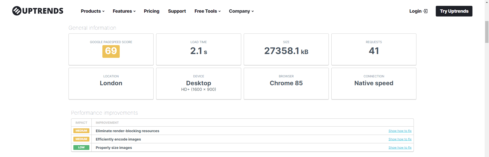
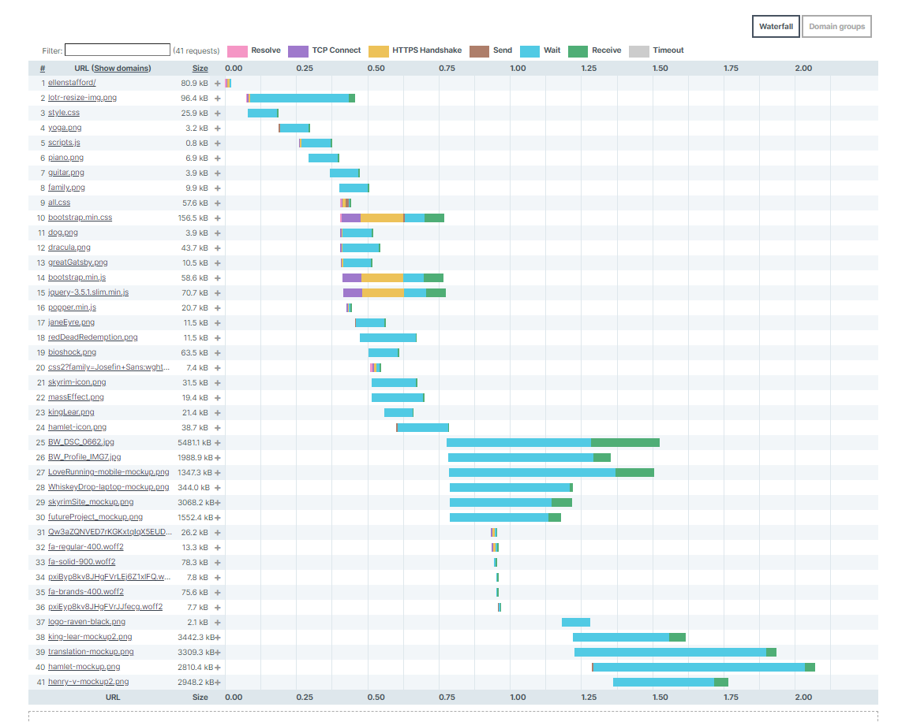
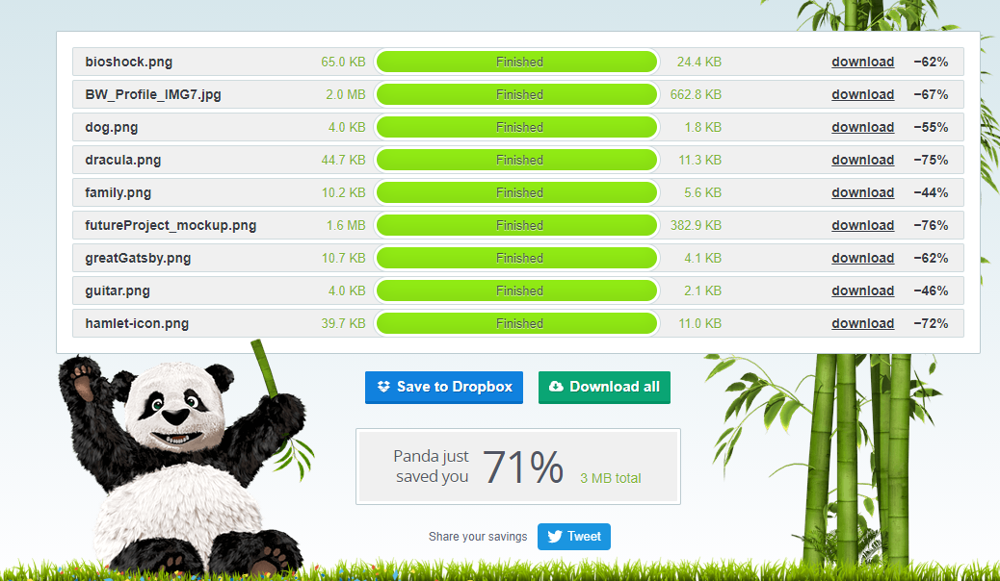
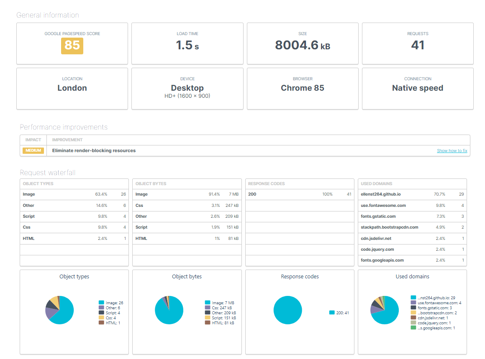
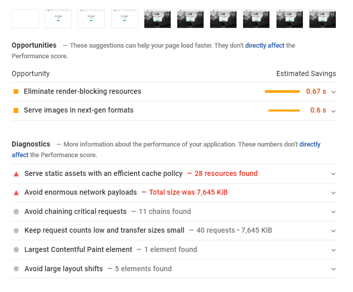
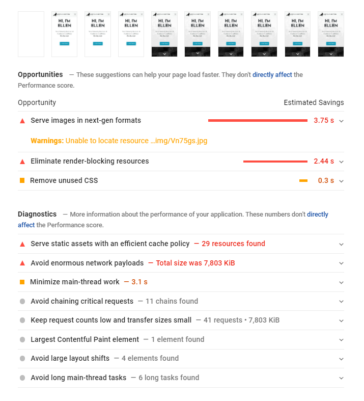

#  Testing 

## Contents

- [Automated Testing](#Automated-Testing)

    - [W3C Validation Service](#W3C-Markup-Validation-Service)

    - [Page Speed / Performance](#Page-Speed/Performance)
        - [Test 1](#Test-1)
        - [Test 2](#Test-2)
        - [Test 3](#Test-3)
        - [Unfixable Performance Issues](Unfixable-Performance-Issues)

- [Testing User Stories](#Testing-User-Stories)

    - [First Time Visitor Goals](#First-Time-Visitor-Goals)

    - [Returning Visitor Goals](#Returning-Visitor-Goals)

-----

## Automated Testing

[W3C Markup Validation Service](https://validator.w3.org/) and [W3C CSS Validation Service](https://jigsaw.w3.org/css-validator/) were used to validate the project's html and css file. 

### W3C Markup Validation Service

Found only minor errors, such as hanging end tags that I had forgot to remove, and typos in the code. 

The validator noted that an ID attribute was called twice, due to me labelling two sections with the same ID by mistake, whilst fixing code. I quickly rectified the issue.

File names on images had spaces which were promptly renamed - fixing the issue.

No major errors were found.

### W3C CSS Validation Service

Found no errors.

However, the validator did find [these errors](assets/img/CSS-validator.PNG) in Bootstrap, but as I cannot edit Bootstrap's CSS files directly, I have no choice but to ignore it.

#### Warnings:

- The following warning were ignored as they can be necessary to ensure functionality on different browsers:
    - `-webkit-transition is an unknown vendor extension`
    - `-moz-transition is an unknown vendor extension`
    - `-o-transition is an unknown vendor extension`
    - `-webkit-background-size is an unknown vendor extension`
    - `-moz-background-size is an unknown vendor extension`
    - `-o-background-size is an unknown vendor extension`
    - `-moz-animation is an unknown vendor extension`
    - `-webkit-animation is an unknown vendor extension`
    - `-webkit-transform is an unknown vendor extension`
    - `-moz-transform is an unknown vendor extension`

- W3C's CSS Validation Service flagged **line 175** as an error.
    - The warning: `auto is not defined by any specification as an allowed value for pointer-events, but is supported in multiple browsers`
    - However, this line is necessary for the functionality of the navbar fullscreen overlay menu - a screenshot of the code can be seen [here](assets/img/codeScreenshot.PNG)
    - Removing this line breaks the navigation links when on the fullscreen overlay - they will no longer be clickable.
    - Ignoring the warning.

- The service flagged **768 warnings in Bootstrap**. As I cannot address these warning directly, I am forced to ignore it. 

### Page Speed/Performace

I used [UpTrends](https://www.uptrends.com/tools/website-speed-test) and Google's [PageSpeed Insights](https://developers.google.com/speed/pagespeed/insights/) to check the speed of my website. Here are my results when using the service:

#### Test 1

The first test resulted in a fairly unsatisfactory score.

The major impact to the site's performance/speed was due to render-blocking resources, inefficient encode images and improper image sizes. This resulted in a load time of 2.1s and would cause notable stuttering when scrolling down the page on mobile devices. 

The following image shows the impact of the the inefficient image sizes to the performance of my site:

It was imperative, then, that I address the issue concerning the image file sizes. To do this, I used [TinyPNG](https://tinypng.com/)

TinyPNG managed to significantly reduce the size of my images, saving me a total of 16 MB - a 72% difference.

### Test 2

Running the second test, after resizing the images, produced fruitful results:

This gave me a 23% increase in performance, and reduced the site's load time by 40%, from 2.1s to 1.5s.

### Test 3 

However this did not mean the site's performance was at its best. I found that my site still had some major performance issues when running through Google's [PageSpeed Insights](https://developers.google.com/speed/pagespeed/insights/) 

| Desktop | Mobile |
| ------- | ------ |
|  |  |

My concern, was the performance impact on mobile, because despite resizing the image files, I still experienced stuttering on mobile devices. Page Insights noted that the images were still impacting performance:

| Desktop | Mobile |
| ------- | ------ |
|  |  |

PageSpeed Insights recommended changing the format of the images from PNG and JPEG to a next-gen format, like webP, which would reduce the screen loading by an estimate of 3.75s on mobile, and 0.67s on desktop. 

- I used multiple online converters to convert my images from PNG to webP, such as [ImageOnline.com](https://image.online-convert.com/convert-to-webp), [Convertio](https://convertio.co/png-webp/) and [Zamzar](https://www.zamzar.com/convert/png-to-webp/). 
    - Online converters often have limits on how many files you can convert, so I used multiple converters.

Converting the images didn't have much impact on the Speed Score, however it did drastically reduce the stuttering when scrolling on mobile devices.

### Unfixable Performance Issues 

The remaining performance impact derives from the render-blocking resources primarily caused by Bootstrap and Font Awesome. The only 'fix' to this issue would be to locally load a limited CSS file for both Bootstrap and Font Awesome, which would *only* call the CSS that I need. 

I tested this on the local repository of the site by doing the following steps:

1. I removed the link to Bootstrap's extenal stylesheet (CDN). 
2. I copied the *used* Bootstrap CSS code from the deployed website by using the [CSS Used](https://chrome.google.com/webstore/detail/css-used/cdopjfddjlonogibjahpnmjpoangjfff?hl=en) extension in [Chrome's DevTools](https://developers.google.com/web/tools/chrome-devtools) 
3. I then minified the code using [CSS Minifier](https://cssminifier.com/)
4. I copied the minified css code into my main CSS file (style.css) before any of my own code.
5. I navigated to the [Bootstrap GitHub Repository](https://github.com/twbs/bootstrap)
6. From there I downloaded `bootstrap-grid.css.min` from *bootstrap/dist/css* and saved it to my assets/css folder in my local directory. 
7. I linked to the newly downloaded `bootstrap.grid.css.min` in my HTML and loaded it before my `style.css` file.
8. I saved the changes made to both `index.html` and `style.css`

This process did work, although it would require some fine tweaking to make it aesthetically identical to the deployed website. Additionally, I did the same process but using a **Custom Bootstrap CSS** file from [here](https://getbootstrap.com/docs/3.4/customize/) in place of `bootstrap-grid.css.min`. This made the site's features more functional but caused visual inconsistencies, such as the font size being a lot smaller than the original website.

There was also the concern of how this would work, if at all, once the website was deployed. Therefore, this may be a 'fix' that I will implement and try to resolve in the future. For now, the issue is not damaging to the site, as the site speed is quick enough to not cause user irritation and intervene with user input. Nevertheless, it will be wise to recitify this issue in the future.

-----

## Testing User Stories

### First Time Visitor Goals 

1. As a first-time visitor, I want to understand the main purpose of the site immediately.

    - Upon entering the site users are greeted with a clean, user friendly navigation bar at the top of the screen, which they can use to go to a page of their choice. Underneath is a hero-image and jumbotron, with the text 'Hi, I'm Ellen. I'm a University Graduate & Freelancer in Software Development' and a button that says 'Learn More' bellow.

    - The main purpose of the site is made clear with the hero image and jumbotron - it tells the user that this site is about, me, with 'Hi, I'm Ellen [...]' and that the site's purpose is to serve as an online porfolio to advertise myself.

2. I want to easily navigate through the site's content.

    - The navigation bar is clear, readable and easy to use. It is fixed which means the user can easily navigate to different parts of the site's page quickly and effortlessly, no matter where they are on the page at that given moment. 

3. I do not want to decode the site's features to be able to use them - no features should be hard to find or hard to perceive as a feature.
    
    - Every button that is clickable is an imperative, which tells the user that it is clickable and that they should interact with it. 

    - No information is hidden, with exception to the project image overlay, which is visible when the mouse hovers over it. Due to the image size, it is unlikely that the user would overlook this feature, particularly as it follows conventions seen on other sites. Nevertheless, a small indication, like a 'hover over me' text, to encourage the user to interact with the image could be added to further improve user experience. 

4. I want to easily find information about the potential candidate I may hire.

    - The fixed navigation bar allows the user to easily navigate to different parts of the site that has the information they require.

    - The 'Learn more' button on the homepage makes it so users can immediately find the information they seek. 

    - Information has been effectively organised so that users can navigate through the site's content, and sift through information easily. 'Read more' buttons are there to indicate to the user that more information can be revealed, which exposes the user to more information without the risk of cognitive overload. 

5. As a first-time visitor, I also want to immediately see the potential of the candidate, which means the site itself needs to meet a desired professional quality.

    - The site fulfills this purpose, but users can also easily navigate to both the Experience page and the Projects page in order to satisfy this goal.

6. I want to be assured that the site is trusted, therefore I want to see social media links to serve as evidence to their major claims.

    - Social media links are provided in the site's footer. There are also references available in the downloadable CV file. 

7. Most significantly, as a first-time visitor, I want to *like* the site so that I will revisit it again.

    - The site encourages user interactivity and reguarly responds to the user's input. 
    
    - The scroll-down and scroll-up arrow buttons give a visually stimulating and effective way for users to navigate through the site, as a navigational feature other than the navbar. 

    - Buttons encourage users to enage with the site.

    - The implementation of a contact form, alongside contact links, makes the user experience more personal and intuitive. 

    - The image carousel is visually stimulating and unqiue to this genre of website, which may make the site more memorable and encourage users to visit again.

### Returning Visitor Goals 

1. As a returning visitor, I want to see the projects the candidate may have worked on.

    - Users can navigate to the Projects page to see both web development projects and academic work. 

    - The projects are emphaised visually, with the large, eye-catching image to grab the users attention and encourage them to lear more.

2. Additionally, I want to see their qualifications, relevant work experience and what skills they have.

    - Users can navigate to the Skills page and the Experience page to see my qualifications and skillsets. Both are represented visually - with progress bars and a timeline. This makes it quicker for users to take in all the information and offers the information to them in an intuitive way that diminishes the risk of cognitive overload.

3. I want to be able to easily contact the candidate at any point throughout my navigation of the site so that they can answer any question I may have.

    - Users can navigate to the contact footer by either users the navigation bar or clicking the 'Hire Me' button on the about page. The fixed navbar fulfills this goal by allowing the users to go to the contact section quickly and easily, regardless of where they are in the site.

4. As a returning visitor, I may want to download a CV in PDF format and see references to validate the candidate’s claims.

    - A download icon for the downloadable CV can be found in the footer with the social media links. A hover tooltip will display on desktop when the user hovers over the icon with their mouse. This tells the users exactly what it is that they will download. 

    - When on mobile devices, a text reading 'Download my CV' will be displayed underneath the download icon in place of the hover tooltip to make the feature easy for the users to understand and use.

## Further Testing 

## Known Bugs 

