#  Testing 

## Contents

- [Automated Testing](#automated-testing)

    - [W3C Validation Service](#w3c-markup-validation-service)

    - [Page Speed / Performance](#page-performance)
        - [Test 1](#test-1)
        - [Test 2](#test-2)
        - [Test 3](#test-3)
        - [Performance Issues](#performance-issues)

- [Testing User Stories](#testing-user-stories)

    - [First Time Visitor Goals](#first-time-visitor-goals)

    - [Returning Visitor Goals](#returning-visitor-goals)

- [Manual Testing](#manual-testing)

    - [Navigation Bar - Desktop](#navigation-bar-desktop)

    - [Navigation Bar - Mobile Devices](#navigation-bar-mobile-devices)

    - [Homepage](#homepage)

    - [About Me Page](#about-me-page)

    - [Skills Page](#skills-page)

    - [Experience Page](#experience-page)

    - [Projects Page](#projects-page)

    - [Carousel](#carousel)

    - [Contact Form](#contact-form)

    - [Footer](#footer)

- [Further Testing](#further-testing)

    - [Desktop](#desktop)

    - [Mobile Devices](#mobile-devices)

- [Known Bugs](#known-bugs)

    - [Navigation Bar Fullscreen Overlay](#navigation-bar-fullscreen-overlay)

    - [Navigation Fullscreen Overlay Fix](#navigation-fullscreen-overlay-fix)

    - [Experience Page Navigation](#experience-page-navigation)

    - [Carousel Page Jump Bug](#carousel-page-jump-bug)

    - [Carousel Horizontal Scrollbar Bug](#carousel-horizontal-scrollbar-bug)

    - [iOS Safari](#ios-safari)

    - [Tablet Devices](#tablet-devices)

    - [Performance](#performance)


-----

## Automated Testing

[W3C Markup Validation Service](https://validator.w3.org/) and [W3C CSS Validation Service](https://jigsaw.w3.org/css-validator/) were used to validate the project's html and css file. 

### W3C Markup Validation Service

Found only minor errors, such as hanging end tags that I had forgot to remove, and typos in the code. 

The validator noted that an ID attribute was called twice, due to me labelling two sections with the same ID by mistake, whilst fixing code. I quickly rectified the issue.

File names on images had spaces which were promptly renamed - fixing the issue.

No major errors were found.


### W3C CSS Validation Service

Found no errors.

However, the validator did find [these errors](assets/img/CSS-validator.png) in Bootstrap, but as I cannot edit Bootstrap's CSS files directly, I have no choice but to ignore it.

#### Warnings:

- The following warning were ignored as they can be necessary to ensure functionality on different browsers:
    - `-webkit-transition is an unknown vendor extension`
    - `-moz-transition is an unknown vendor extension`
    - `-o-transition is an unknown vendor extension`
    - `-webkit-background-size is an unknown vendor extension`
    - `-moz-background-size is an unknown vendor extension`
    - `-o-background-size is an unknown vendor extension`
    - `-moz-animation is an unknown vendor extension`
    - `-webkit-animation is an unknown vendor extension`
    - `-webkit-transform is an unknown vendor extension`
    - `-moz-transform is an unknown vendor extension`

- W3C's CSS Validation Service flagged **line 175** as an error.
    - The warning: `auto is not defined by any specification as an allowed value for pointer-events, but is supported in multiple browsers`
    - However, this line is necessary for the functionality of the navbar fullscreen overlay menu - a screenshot of the code can be seen [here](assets/img/navbar_code_screenshot.png)
    - Removing this line breaks the navigation links when on the fullscreen overlay - they will no longer be clickable.
    - Ignoring the warning.

- The service flagged **768 warnings in Bootstrap**. As I cannot address these warning directly, I am forced to ignore it. 


### Page Performance

I used [UpTrends](https://www.uptrends.com/tools/website-speed-test) and Google's [PageSpeed Insights](https://developers.google.com/speed/pagespeed/insights/) to check the speed of my website. Here are my results when using the service:

#### Test 1

The first test resulted in a fairly unsatisfactory score.

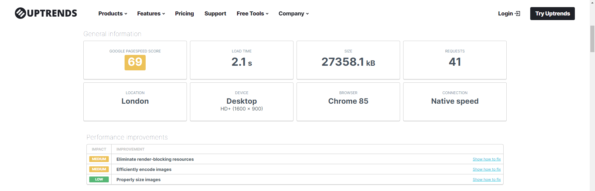

The major impact to the site's performance/speed was due to render-blocking resources, inefficient encode images and improper image sizes. This resulted in a load time of 2.1s and would cause notable stuttering when scrolling down the page on mobile devices. 


The following image shows the impact of the the inefficient image sizes to the performance of my site:

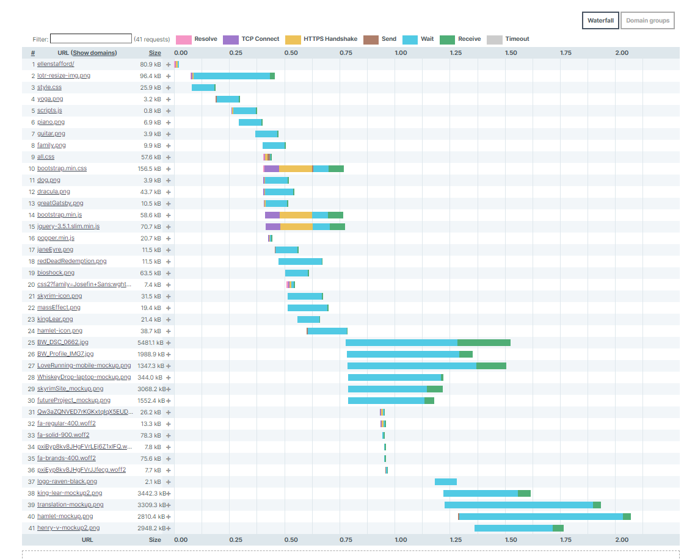


It was imperative, then, that I address the issue concerning the image file sizes. To do this, I used [TinyPNG](https://tinypng.com/)

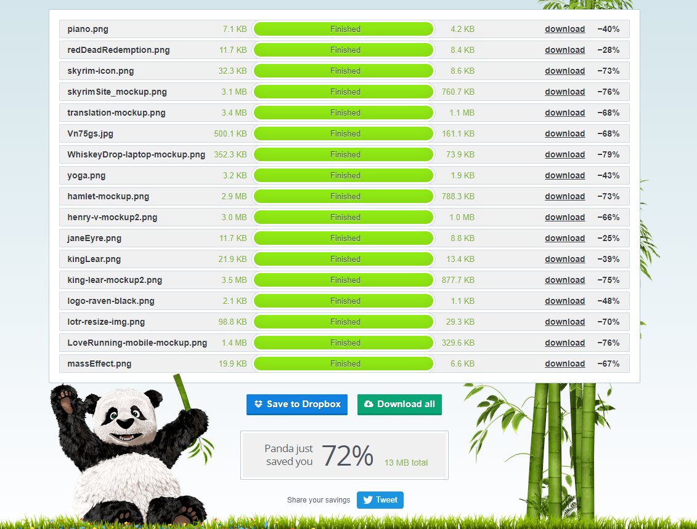
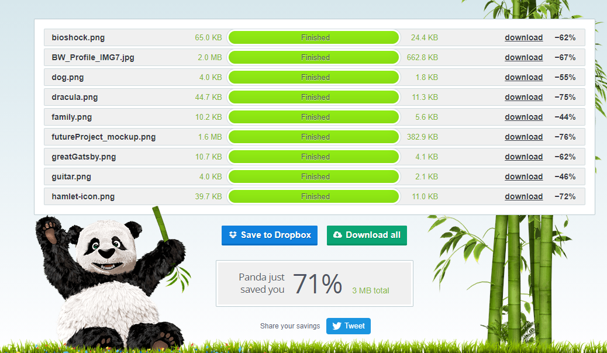

TinyPNG managed to significantly reduce the size of my images, saving me a total of 16 MB - a 72% difference.


### Test 2

Running the second test, after resizing the images, produced fruitful results:

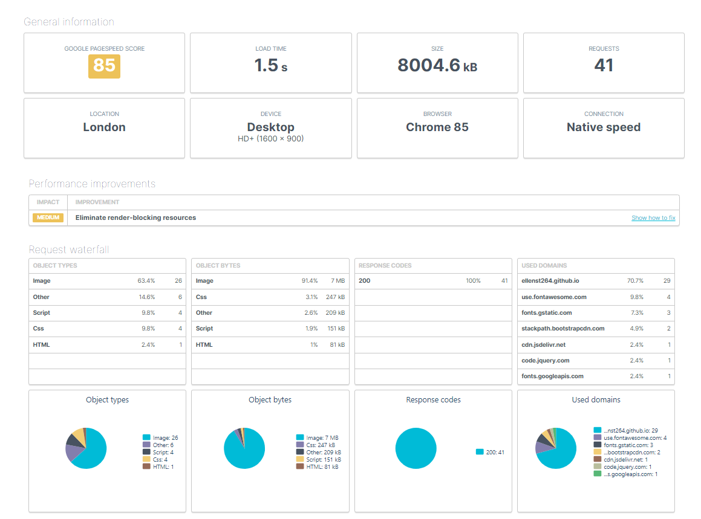

This gave me a 23% increase in performance, and reduced the site's load time by 40%, from 2.1s to 1.5s.


### Test 3 

However this did not mean the site's performance was at its best. I found that my site still had some major performance issues when running through Google's [PageSpeed Insights](https://developers.google.com/speed/pagespeed/insights/) 

| Desktop | Mobile |
| ------- | ------ |
| 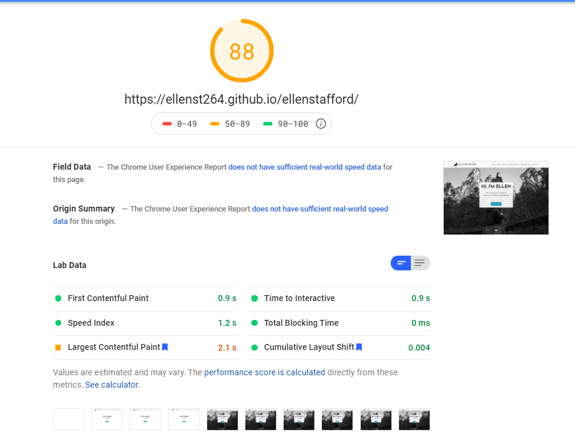 | 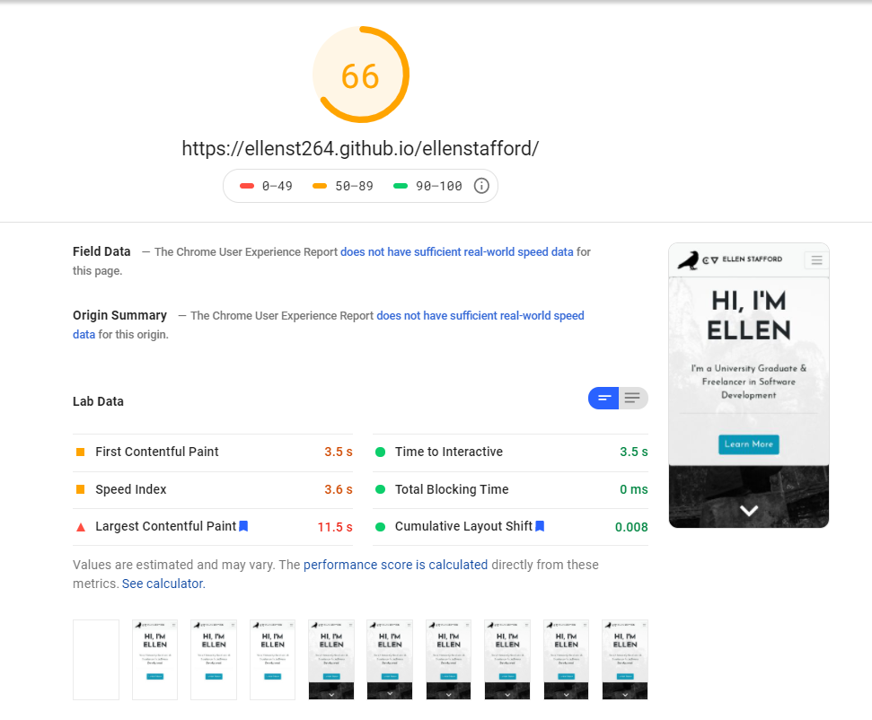 |

My concern, was the performance impact on mobile, because despite resizing the image files, I still experienced stuttering on mobile devices. Page Insights noted that the images were still impacting performance:

| Desktop | Mobile |
| ------- | ------ |
|  | 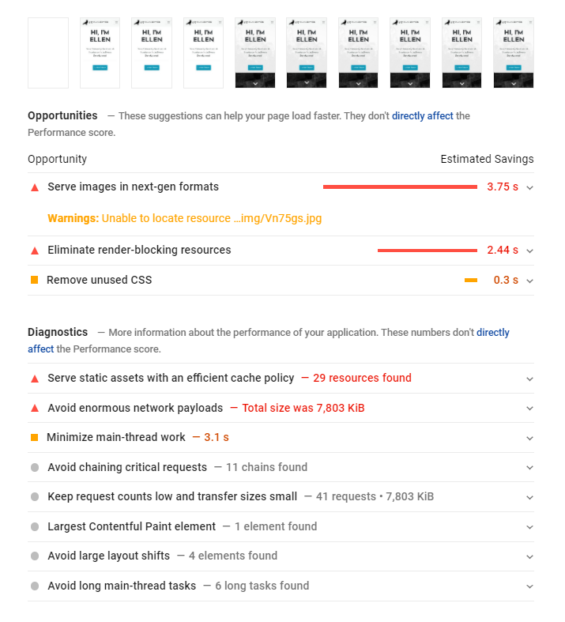 |

PageSpeed Insights recommended changing the format of the images from PNG and JPEG to a next-gen format, like webP, which would reduce the screen loading by an estimate of 3.75s on mobile, and 0.67s on desktop. 

- I used multiple online converters to convert my images from PNG to webP, such as [ImageOnline.com](https://image.online-convert.com/convert-to-webp), [Convertio](https://convertio.co/png-webp/) and [Zamzar](https://www.zamzar.com/convert/png-to-webp/). 
    - Online converters often have limits on how many files you can convert, so I used multiple converters.

Converting the images didn't have much impact on the Speed Score, however it did drastically reduce the stuttering when scrolling on mobile devices.


### Performance Issues 

The remaining performance impact derives from the render-blocking resources primarily caused by Bootstrap and Font Awesome. The only 'fix' to this issue would be to locally load a limited CSS file for both Bootstrap and Font Awesome, which would *only* call the CSS that I need. 

I tested this on the local repository of the site by doing the following steps:

1. I removed the link to Bootstrap's extenal stylesheet (CDN). 
2. I copied the *used* Bootstrap CSS code from the deployed website by using the [CSS Used](https://chrome.google.com/webstore/detail/css-used/cdopjfddjlonogibjahpnmjpoangjfff?hl=en) extension in [Chrome's DevTools](https://developers.google.com/web/tools/chrome-devtools) 
3. I then minified the code using [CSS Minifier](https://cssminifier.com/)
4. I copied the minified css code into my main CSS file (style.css) before any of my own code.
5. I navigated to the [Bootstrap GitHub Repository](https://github.com/twbs/bootstrap)
6. From there I downloaded `bootstrap-grid.css.min` from *bootstrap/dist/css* and saved it to my assets/css folder in my local directory. 
7. I linked to the newly downloaded `bootstrap.grid.css.min` in my HTML and loaded it before my `style.css` file.
8. I saved the changes made to both `index.html` and `style.css`

This process did work, although it would require some fine tweaking to make it aesthetically identical to the deployed website. Additionally, I did the same process but using a **Custom Bootstrap CSS** file from [here](https://getbootstrap.com/docs/3.4/customize/) in place of `bootstrap-grid.css.min`. This made the site's features more functional but caused visual inconsistencies, such as the font size being a lot smaller than the original website.

There was also the concern of how this would work, if at all, once the website was deployed. Therefore, this may be a 'fix' that I will implement and try to resolve in the future. For now, the issue is not damaging to the site, as the site speed is quick enough to not cause user irritation and intervene with user input. Nevertheless, it will be wise to recitify this issue in the future.

-----

## Testing User Stories

### First Time Visitor Goals 

1. As a first-time visitor, I want to understand the main purpose of the site immediately.

    - Upon entering the site users are greeted with a clean, user friendly navigation bar at the top of the screen, which they can use to go to a page of their choice. Underneath is a hero-image and jumbotron, with the text 'Hi, I'm Ellen. I'm a University Graduate & Freelancer in Software Development' and a button that says 'Learn More' bellow.

    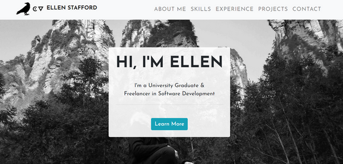

    - The main purpose of the site is made clear with the hero image and jumbotron - it tells the user that this site is about, me, with 'Hi, I'm Ellen [...]' and that the site's purpose is to serve as an online porfolio to advertise myself.

2. I want to easily navigate through the site's content. 

    - The navigation bar is clear, readable and easy to use. It is fixed which means the user can easily navigate to different parts of the site's page quickly and effortlessly, no matter where they are on the page at that given moment.

    | Desktop | Mobile |
    | ------- | ------ |
    | 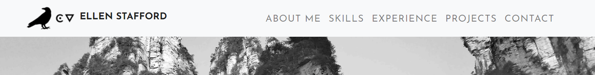 | 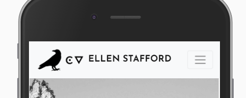
    
    - The fullscreen overlay menu for the navigation bar provides greater and easier usability for users on smaller touch screen devices. 

    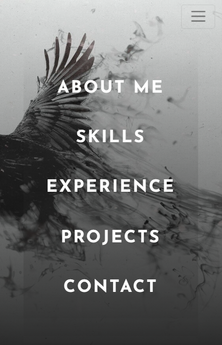

3. I do not want to decode the site's features to be able to use them - no features should be hard to find or hard to perceive as a feature.

    - Every button that is clickable is an imperative, which tells the user that it is clickable and that they should interact with it. 

    | Learn More Button | Hire Me Button | Read More Button | Send Button | 
    | ----------------- | -------------- | ---------------- | ----------- | 
    |  |  |  |  | 

    - No information is hidden, with exception to the project image overlay, which is visible when the mouse hovers over it. Due to the image size, it is unlikely that the user would overlook this feature, particularly as it follows conventions seen on other sites. Nevertheless, a small indication, like a 'hover over me' text, to encourage the user to interact with the image could be added to further improve user experience. 

    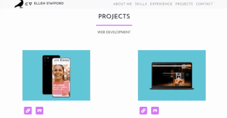

4. I want to easily find information about the potential candidate I may hire.

    - The fixed navigation bar allows the user to easily navigate to different parts of the site that has the information they require.

    - The 'Learn more' button on the homepage makes it so users can immediately find the information they seek. 

    - Information has been effectively organised so that users can navigate through the site's content, and sift through information easily. 'Read more' buttons are there to indicate to the user that more information can be revealed, which exposes the user to more information without the risk of cognitive overload. 

5. As a first-time visitor, I also want to immediately see the potential of the candidate, which means the site itself needs to meet a desired professional quality.

    - The site fulfills this purpose, but users can also easily navigate to both the Experience page and the Projects page in order to satisfy this goal.

6. I want to be assured that the site is trusted, therefore I want to see social media links to serve as evidence to their major claims.

    - Social media links are provided in the site's footer. There are also references available in the downloadable CV file. 

    

7. Most significantly, as a first-time visitor, I want to *like* the site so that I will revisit it again.

    - The site encourages user interactivity and reguarly responds to the user's input. 

    
    
    - The scroll-down and scroll-up arrow buttons give a visually stimulating and effective way for users to navigate through the site, as a navigational feature other than the navbar.

    | Scroll Down | Scroll to Top |
    | ------- | ------ |
    |  |  

    - Buttons encourage users to enage with the site.

    | Learn More Button | Hire Me Button | Read More Button | Send Button | Project Links |
    | ----------------- | -------------- | ---------------- | ----------- | ------------- |
    |  |  |  |  |  |

    - The implementation of a contact form, alongside contact links, makes the user experience more personal and intuitive. 

    - The image carousel is visually stimulating and unqiue to this genre of website, which may make the site more memorable and encourage users to visit again.

    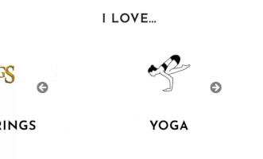


### Returning Visitor Goals 

1. As a returning visitor, I want to see the projects the candidate may have worked on.

    - Users can navigate to the Projects page to see both web development projects and academic work. 

    - The projects are emphaised visually, with the large, eye-catching image to grab the users attention and encourage them to learn more.

2. Additionally, I want to see their qualifications, relevant work experience and what skills they have.

    - Users can navigate to the Skills page and the Experience page to see my qualifications and skillsets. Both are represented visually - with progress bars and a timeline. This makes it quicker for users to take in all the information and offers the information to them in an intuitive way that diminishes the risk of cognitive overload.

3. I want to be able to easily contact the candidate at any point throughout my navigation of the site so that they can answer any question I may have.

    - Users can navigate to the contact footer by either using the navigation bar or clicking the 'Hire Me' button on the about page. 

    - The fixed navbar fulfills this goal by allowing the users to go to the contact section quickly and easily, regardless of where they are in the site.

4. As a returning visitor, I may want to download a CV in PDF format and see references to validate the candidate’s claims.

    - A download icon for the downloadable CV can be found in the footer with the social media links. A hover tooltip will display when the user hovers over the icon with their mouse on desktop. This tells the users exactly what it is that they will download. 

    - When on mobile devices, a text reading 'Download my CV' will be displayed underneath the download icon in place of the hover tooltip to make the feature easy for users to understand and use.

    | CV in PDF Format - Desktop | CV in PDF Format - Mobile |
    | ------- | ------ |
    |  |  


## Manual Testing 

-----

### Navigation Bar - Desktop

| No. |   Action    |   Input   |   Expected Output |   Actual Output   |   Result |  Further Comments |
| --- | ----------- | --------- | ----------------- | ----------------- | ---------| ----------------- |
|  1  | Navigate to `About Me` | Click the `About Me` nav link | The site will navigate to the `About Me` page | Navigates to `About Me` page | Pass |
|  2  | Navigate to `Skills` | Click the `Skills` nav link | The site will navigate to the `Skills` page | Navigates to `Skills` page | Pass |
|  3  | Navigate to `Contact` | Click the `Contact` nav link | The site will navigate to the `Contact` page | Navigates to `Contact` page | Pass |
|  4  | Navigate to `Homepage` | Click the `Navbar brand` | The site will navigate back up to the `Homepage` when the navbar brand is clicked | Navigates to `Homepage` | Pass |
|  5  | Navigate to `Experience` - `Education` | Click the `Experience` nav link and then `Education` on the drop-down menu | Upon clicking `Experience` the drop-down menu will be visible. The site will navigate to the `Education` section once clicked | Clicking `Experience` opens the drop-down menu. Navigates to `Education` section when `Education` is clicked in drop-down menu | Pass | When navigating to `Education` when in the `Work Experience` the navlink doesn't work. Refer [here](#experience-page-navigation) for more details|
|  6  | Navigate to `Experience` - `Work Experience` | Click the `Experience` nav link and then `Work Experience` on the drop-down menu | Upon clicking `Experience` the drop-down menu will be visible. The site will navigate to the `Work Experience` section once clicked | Clicking `Experience` opens the drop-down menu. Navigates to `Work Experience` section when `Education` is clicked in drop-down menu | Pass | When navigating to `Work Experience` when in the `Education` section the navlink doesn't work. Refer [here](#experience-page-navigation) for more details |
|  7  | Navigate to `Experience` - `Achievements` | Click the `Experience` nav link and then `Achievements` on the drop-down menu | Upon clicking `Experience` the drop-down menu will be visible. The site will navigate to the `Achievements` section once clicked | Clicking `Experience` opens the drop-down menu. Navigates to `Education` section when `Achievements` is clicked in drop-down menu | Pass | 
|  8  | Navigate to `Projects` - `Web Development` | Click the `Projects` nav link and then `Web Development` on the drop-down menu | Upon clicking `Projects` the drop-down menu will be visible. The site will navigate to the `Web Development` section once clicked | Clicking `Projects` opens the drop-down menu. Navigates to `Web Development` section when `Projects` is clicked in drop-down menu | Pass |
|  9  | Navigate to `Projects` - `Academic Work` | Click the `Projects` nav link and then `Academic Work` on the drop-down menu | Upon clicking `Projects` the drop-down menu will be visible. The site will navigate to the `Academic Work` section once clicked | Clicking `Projects` opens the drop-down menu. Navigates to `Academic Work` section when `Projects` is clicked in drop-down menu | Pass |
|  11 | Navbar will transform on scroll | Scroll down the page | The navbar size will shrink on mouse scroll | Upon scrolling down the navbar shrinks in size | Pass |

-----

### Navigation Bar - Mobile Devices

| No. |   Action    |   Input   |   Expected Output |   Actual Output   |   Result |  Further Comments |
| --- | ----------- | --------- | ----------------- | ----------------- | ---------| ----------------- |
|  1  | Open navbar fullscreen overlay menu | Click the burger icon | Will open the fullscreen overlay menu, filling the entire screen | Opens the fullscreen overlay menu | Pass |
|  2  | Navigate to `About Me` | Click the burger icon then click the `About Me` nav link in the fullscreen overlay menu | The fullscreen overlay menu will close and navigate to the `About Me` page | Closes the fullscreen overlay menu and navigates to `About Me` page | Pass |
|  3  | Navigate to `Skills` | Click the burger icon then click the `Skills` nav link in the fullscreen overlay menu | The fullscreen overlay menu will close and navigate to the `Skills` page | Closes the fullscreen overlay menu and navigates to `Skills` page | Pass |
|  4  | Navigate to `Contact` | Click the burger icon then click the `Contact` nav link in the fullscreen overlay menu | The fullscreen overlay menu will close and navigate to the `Contact` page | Closes the fullscreen overlay menu and navigates to `Contact` page | Pass |
|  5  | Navigate to `Homepage` | Click the `Navbar brand` | The site will navigate back up to the `Homepage` when the navbar brand is clicked | Navigates to `Homepage` | Pass |
|  6  | Navigate to `Experience` - `Education` | Click the burger icon. In the fullscreen screen overlay menu click the `Experience` navlink then `Education` in the dropdown menu | Upon clicking `Experience` the drop-down menu will be visible. Once `Education` is clicked the fullscreen overlay menu will close and navigate to the `Education` section  | Clicking `Experience` opens the drop-down menu, clicking `Education` in the drop-down menu closes the fullscreen overlay and navigates to the `Education` section | Pass | When navigating to `Education` when in the `Work Experience` the navlink doesn't work. Refer [here](#experience-page-navigation) for more details |
|  7  | Navigate to `Experience` - `Work Experience` | Click the burger icon. In the fullscreen screen overlay menu click the `Experience` navlink then `Work Experience` in the dropdown menu | Upon clicking `Experience` the drop-down menu will be visible. Once `Work Experience` is clicked the fullscreen overlay menu will close and navigate to the `Work Experience` section  | Clicking `Experience` opens the drop-down menu, clicking `Work Experience` in the drop-down menu closes the fullscreen overlay and navigates to the `Work Experience` section | Pass | When navigating to `Work Experience` when in the `Education` section the navlink doesn't work. Refer [here](#experience-page-navigation) for more details |
|  8  | Navigate to `Experience` - `Achievements` | Click the burger icon. In the fullscreen screen overlay menu click the `Experience` navlink then `Achievements` in the dropdown menu | Upon clicking `Experience` the drop-down menu will be visible. Once `Achievements` is clicked the fullscreen overlay menu will close and navigate to the `Achievements` section  | Clicking `Experience` opens the drop-down menu, clicking `Achievements` in the drop-down menu closes the fullscreen overlay and navigates to the `Achievements` section | Pass | 
|  9  | Navigate to `Projects` - `Web Development` | Click the burger icon. In the fullscreen screen overlay menu click the `Projects` navlink then `Web Development` in the dropdown menu | Upon clicking `Projects` the drop-down menu will be visible. Once `Web Development` is clicked the fullscreen overlay menu will close and navigate to the `Web Development` section  | Clicking `Projects` opens the drop-down menu, clicking `Web Development` in the drop-down menu closes the fullscreen overlay and navigates to the `Web Development` section | Pass | 
|  10 | Navigate to `Projects` - `Academic Work` | Click the burger icon. In the fullscreen screen overlay menu click the `Projects` navlink then `Academic Work` in the dropdown menu | Upon clicking `Projects` the drop-down menu will be visible. Once `Academic Work` is clicked the fullscreen overlay menu will close and navigate to the `Academic Work` section  | Clicking `Projects` opens the drop-down menu, clicking `Academic Work` in the drop-down menu closes the fullscreen overlay and navigates to the `Academic Work` section | Pass | 
|  11 | Navbar will transform on scroll | Scroll down the page | The navbar size will shrink on mouse scroll | Upon scrolling down the navbar shrinks in size | Pass |
|  12 | Navbar `hamburger button` - `mobile devices` | In `DevTools` toggle device toolbar and change device to iPhone 6/7/8 | The `hamburger button` should be inline with the navbar to the right hand side of the screen | The `hamburger button` displays underneath the navbar brand rather than beside it | Fail | Once the users scrolls, causing the navbar brand and navbar links to shrink, this problem is no longer in effect |


----
### Homepage 

| No. |   Action / Feature    |   Input   |   Expected Output |   Actual Output   |   Result |  Further Comments |
| --- | ----------- | --------- | ----------------- | ----------------- | ---------| ----------------- |
|  1  | `Learn More` jumbotron button | Click `Learn More` button | Will navigate the user to `About Me` | Navigates to `About Me` | Pass |
|  2  | `Scroll-down arrow` button | Click `scroll-down` button | Will navigate the user to `About Me` | Navigates to `About Me` | Pass |
|  3  | Testing above features on `mobile devices` | See above | See above | Both tests work as expected | Pass |


-----

### About Me Page 

| No. |   Action / Feature    |   Input   |   Expected Output |   Actual Output   |   Result |  Further Comments |
| --- | ----------- | --------- | ----------------- | ----------------- | ---------| ----------------- |
|  1  | `Hire Me` button in callout card | Click `Hire Me` button | Will navigate to `Contact` section | Navigates to `Contact` section | Pass |
|  2 | Testing above feature on `mobile devices` | See above | See above | Work as expected | Pass |
|  3  | `Overflow scroll` on `mobile devices` | On the chapter content the user will scroll through the content **first** before scrolling down the page onto the next section | `Overflow scroll` will work as intended and allow the user to scroll through the content without scrolling down the page | `Overflow scroll` function works and allows users to scroll through the content without scrolling down the page | Pass |


-----

### Skills Page

| No. |   Action / Feature    |   Input   |   Expected Output |   Actual Output   |   Result |  Further Comments |
| --- | ----------- | --------- | ----------------- | ----------------- | ---------| ----------------- |
|  1  | `Overflow scroll` | Hover mouse over the chapter content section (the white background) and scroll | `Overflow scroll` will work as intended and allow the user to scroll through the content without scrolling down the page | `Overflow scroll` function works and allows users to scroll through the content without scrolling down the page | Pass |
|  2  | `Overflow scroll` on `mobile devices` | On the chapter content the user will scroll through the content **first** before scrolling down the page onto the next section | `Overflow scroll` will work as intended and allow the user to scroll through the content without scrolling down the page | `Overflow scroll` function works and allows users to scroll through the content without scrolling down the page | Pass |
|  3  | `Progress bars` scale animation on `desktop` | Hover the mouse over the `progress bars` to trigger the scale animation | The scale transition animation will trigger on mouse hover | Hovering the mouse over the `progress bars` triggers the small scale animation | Pass |


-----

### Experience Page 

| No. |   Action / Feature    |   Input   |   Expected Output |   Actual Output   |   Result |  Further Comments |
| --- | ----------- | --------- | ----------------- | ----------------- | ---------| ----------------- |
|  1  | `Overflow scroll` | Hover mouse over the chapter content section (the white background) and scroll | `Overflow scroll` will work as intended and allow the user to scroll through the content without scrolling down the page | `Overflow scroll` function works and allows users to scroll through the content without scrolling down the page | Pass |
|  2  | `Overflow scroll` on `mobile devices` | On the chapter content the user will scroll through the content **first** before scrolling down the page onto the next section | `Overflow scroll` will work as intended and allow the user to scroll through the content without scrolling down the page | `Overflow scroll` function works and allows users to scroll through the content without scrolling down the page | Pass |
|  3  | `Read More` button - `show` | Click `Read More` button | Will show hidden collapsable content on click | Clicking `Read More` reveals the hidden text | Pass |
|  4  | `Read More` button - `hide` | Click the same `Read More` button for a second time | Will hide the revealed collapsable content on click | Hides the revealed content | Pass |
|  5  | Testing `Read More` features on `mobile devices` | See above | See above | Works as expected | Pass |
|  6  | Song `links` in `Achievements` | Click `Read More` in the **Won Award in Chinese Song Contest** timeline card then click the `links` highlighted in blue | Will open a new tab taking users to a YouTube page for the appropriate song link | Takes users to **YouTube** but **doesn't** open a new tab | Pass & Fail | Need to add `target="_blank"` to anchor tag |
|  7  | Fix song `links` in `Achievements` | Add `target="_blank"` to both `anchor tags`, save then navigate to the `links` in browser | Will open a **new tab** taking users to a YouTube page for the appropriate song link | Opens a **new tab** taking users to a YouTube | Pass |


-----


### Projects Page 

| No. |   Action / Feature    |   Input   |   Expected Output |   Actual Output   |   Result |  Further Comments |
| --- | ----------- | --------- | ----------------- | ----------------- | ---------| ----------------- |
|  1  | `Overlay content` for project `image` | Hover mouse over the project `image` | Will display `overlay content` when the mouse hovers over the `image` | Displays the `overlay content` on mouse hover | Pass |
|  2  | Project `image` and `overlay content` scale transform | Hover mouse over the project `image` | Both the project `image` and its `overlay content` will increase in size with a `transform (scale)` animation on mouse hover | On mouse hover both the `image` and its `overlay content` increase in size with a graceful `transform (scale)` animation | Pass |
|  3  | `Overlay content` - inactive for  `mobile devices` | Hover mouse or click project `image` | The project `overlay content` will not display on click or hover | The `overlay content` does not activate when hovering over or clicking the project `image` | Pass | The project `overlay content` has a minimum width of 992px, which prevents the feature from activating on mobile devices in order to maintain good UX design |
|  4  | `Overlay content` - visible content under the project `image` for `mobile devices` | N/A | The `overlay content` will be displayed underneath the project `image` on `mobile devices`, replacing the `overlay content` hover function | The `overlay content` is displayed underneath the project `image` when on `mobile devices` | Pass | This is visible at 992px and above - the point at which the project `overlay` no longer functions on mouse hover |
|  5  | `Project links` | Click `project link` icon | Clicking the `project link` icon will direct users to a `new tab` containing the appropriate project | Navigates to a `new tab` containing the appropriate project when clicking the `link` icon | Pass | On mouse hover the `project link` icons for the `Web Development` section will display a small hyphen next to icon. This is not intented but causes no real disruptions for the user. This is a very minor visual bug |
|  5  | Project `GitHub links` | Click project `GitHub` icon | Clicking the project `GitHub` icon will direct users to a `new tab` containing a `GitHub repository` for the appropriate project | Navigates to a `new tab` containing a `GitHub repository` for the appropriate project when clicking the `GitHub` icon | Pass | Only implemented in the `Web Development` section |
|  6  | Testing `GitHub links` and `project links` on `mobile devices` | See above | See above | Works as expected | Pass |


-----

### Carousel

| No. |   Action / Feature    |   Input   |   Expected Output |   Actual Output   |   Result |  Further Comments |
| --- | ----------- | --------- | ----------------- | ----------------- | ---------| ----------------- |
|  1  | Automatic image slide | N/A | The `carousel` should slide through images automatically without the need for user input | The `carousel` slides through images automatically without input | Pass |
|  2  | Manual controls - `next` | Click the `carousel` right arrow button | Upon clicking the right arrow the `carousel` will slide to the `next image` | Slides to the `next carousel image` when the right arrow is clicked | Pass |
|  3  | Manual controls - `previous` | Click the `carousel` left arrow button | Upon clicking the left arrow the `carousel` will slide to the `previous image` | Slides to the `previous carousel image` when the left arrow is clicked | Pass |
|  4  | See if all `carousel images` work correctly | Either wait for the `carousel` to automatically slide through every image **or** manually sift through images with the arrow `controls` | Every `image` in the `carousel` will load | `Shakespeare's *King Lear* image` did not load | Fail | Used `DevTools` to locate the source of the error. Discovered that I had used the wrong `image format` in `HTML` - `HTML` was calling a `png` image that did not exist |
|  5  | Fix `Shakspeare's *King Lear* image` for `carousel` | Change `image format` from `png` to `webp`. Save changes in `HTML` and `commit` to `GitHub` | All `carousel images` will load | All `images` loaded | Pass |
|  6  | Visible on `desktop` and `tablet devices` | In `DevTools` change device toolbar to `desktop` and `tablet` (Ipad) | The `carousel` will be visible | The `carousel` is visible | Pass | Has a minimum width of 768px |
|  7  | Hidden on `mobile devices` | In `DevTools` change device toolbar to `mobile` | The `carousel` will be hidden | The `carousel` is hidden | Pass | Hides the `carousel` at 767px |


-----


### Contact Form 

| No. |   Action / Feature    |   Input   |   Expected Output |   Actual Output   |   Result |  Further Comments |
| --- | ----------- | --------- | ----------------- | ----------------- | ---------| ----------------- |
|  1  | Test `contact form` `text field` | Click a `text field` and `input data` by typing on the keyboard | Users will be able to `input data` into the `text field` of the `contact form` | Can `input data` into the `text field` | Pass | Tested for every `text field` |
|  2  | Test `required boolean attribute` functionality | Click the `send` button without inputting data | A notification will show by the first empty `required text field` telling the user to `input data`. The `send` function will be blocked until all `requried text fields` are filled out | Displays a notification by the first empty `required text field` (in this case, `first name`) and tells the user to `input data`. The `send` button will not function whilst the `required text fields` are empty | Pass |
|  3  | Test `requried boolean attribute` functionality with **some** `text fields` filled in | On the `contact form` fill **one or more**, but not all, (maximum of 3) `requried text fields` and click `send` | A notification will show on the first empty `required text field` telling the user to `input data`. The `send` function will be blocked until all `requried text fields` are filled out | Displays a notification by the first empty `required text field` and tells the user to `input data`. The `send` button will not function whilst the `required text fields` are empty | Pass |
|  4  | Test `email input type` | Click on the `email input field` and input data that **is not** an email (e.g. a 'name' or 'hi') | A notification will show by the `email input field` telling the user to `include a '@' in the email address`. The `send` button will not function until this is resolved | Shows a notification by the `email input field` telling the user to `include a '@' in the email address`. The `send` button is blocked | Pass |
|  5  | `Send` completed `contact form` | Fill in **at least all** of the  `required text fields` and click `send` | Will `send` the inputted data and `refresh` the `contact form` | Opens your device's email application and automatically composes a new email with the addresse field already filled in. The `contact form` does not refresh unless the site itself is refreshed **manually** | Pass & Fail | The `contact form` passes its **functionality test** but doesn't work how I want it to. In the future, I would like to alter the `contact form` so that it will send the inputted data **automatically** to the email listed in the `mailto form action` without requiring **additional steps** from the user |


-----

### Footer 

| No. |   Action / Feature    |   Input   |   Expected Output |   Actual Output   |   Result |  Further Comments |
| --- | ----------- | --------- | ----------------- | ----------------- | ---------| ----------------- |
|  1  | `Scroll to top` arrow button | Click `scroll to top` | Will navigate the user back up to the `homepage` | Navigates to `homepage` | Pass |
|  2  | `Email` icon link | Click the `email` icon link | Will open up the device's email application and compose a new email with the addresse already filled in | Opens the device's email application and composes a new email with the email listed in the `mailto form action` already filled in the addresse tab | Passed |
|  3  | `GitHub`icon link | Click the `GitHub` icon | Will navigate to my GitHub page via a new tab | Opens a new tab for my GitHub page | Pass |
|  4  | `Linkedin` icon link | Click the `Linkedin` icon | Will navigate to Linkedin via a new tab | Opens a new tab for Linkedin | Pass |
|  5  | `Skype` icon link | Click the `Skype` icon | Will navigate to Skype via a new tab | Opens a new tab for Skype | Pass |
|  6  | `DeviantArt` icon link | Click the `DeviantArt` icon | Will navigate to DeviantArt via a new tab | Opens a new tab for DeviantArt | Pass |
|  7  | `Download` icon link | Click the `download` icon | Will navigate to downloadable PDF file (my CV) via a new tab | Opens a new tab for my CV as a downloadable PDF file | Pass |
|  8  | `Hover tooltip` for downloadable CV | Hover mouse over the `download CV` icon link | Will display a tooltip that says `download my CV!` | Hovering the mouse over the `download` icon displays a `tooltip` that says `download my CV!` | Pass | This is for **desktop only** |
|  9  | CV download `responsiveness` | On `DevTools` toggle device toolbar and change the device to **tablet** (or any phone) | Will display text underneath the `download` icon that says `download my CV!` | Changing the device to **tablet**, or anything smaller than tablet, displays the text, `download my CV!`, underneath the `download` icon | Pass | The `download my CV` text displays at a maximum of 991px. It replaces the `hover tooltip` function when on `mobile devices` |


## Further Testing 

### Desktop 

- Hardware 
    - MSI GE72MVR Apache Pro Laptop
    - Desktop PC with a AOC 2560 x 1440 monitor 
    - Desktop PC with a 1920 x 1080 monitor
    - Desktop PC with a 1600 x 900 monitor
    - HP Spectre x360 Laptop
    - HP Pavilion 14-ce3600sa Laptop
    - HP Pavilion 14-ce3602sa Laptop
    - Apple MacBook Air 

- Operating Systems
    - Windows 10
    - iOS

- Browsers
    - Windows 10
        - Google Chrome
        - Brave 
        - Microsoft Edge
    - iOS
        - Google Chrome
        - Safari
            - Bug noted, see [here](#ios-safari)


### Mobile Devices

- Hardware
    - Honor 20 Pro
    - Samsung S8 +
    - Samsung A20
    - Iphone 7   -  no image 
    - Sony Xperia Z3 Plus
    - Sony Xperia Z4 Tablet 
        - Bug noted, see [here](#tablet-devices)


- Operating Systems
    - Andriod
    - iOS


- Browsers
    - Android 
        - Google Chrome
        - Huawei browser
        - Opera 
        - Firefox 
            - doesnt work, see [here]

    - iOS
        - Safari 
            - Bug noted, see [here](#ios-safari)


## Known Bugs 

### Navigation Bar Fullscreen Overlay

The **fullscreen overlay menu** was added to the project to provide a better user experience for users on mobile devices. When on mobile or tablet devices the navbar would collapse and in its place would be a **hamburger button** to the right side of the navbar. When clicked it would open the fullscreen overlay menu containing the navigation links.

The overlay menu occupies the entire viewport of the device, which makes it easier for users to use on **touchscreen devices**, particularly for those users who own very **small** touchscreen devices. With this layout, navigation links are easier to click. 

This was why I implemented the fullscreen overlay menu to this project, but adding it gave rise to a few bugs.
 
- Without Javascript, users had to manually close the fullscreen overlay menu after clicking a navlink. 
    - This increased the amount of steps required from users and may have easily caused confusion and irritation. 
    - Added JQuery to address this issue and ensure good UX design. 

However, after adding JQuery new problems arised:

Although the fullscreen menu would close after clicking a navlink, as intended, when returning to the hamburger button again the overlay would flash and close. Multiple clicks were required to get it to open again. This is explained in depth in the table below:

| Click No. |       Standard navlink        |       Drop-down menu navlink      |  
| --------- | ----------------------------- | --------------------------------- |
|   1   | works as intended | overlay menu opens but then closes when clicking the drop-down menu navlink |
|   2   | overlay menu flashes then closes | overlay menu flashes then closes |
|   3   | works as intended - can click the navlink | works as intended - can click the drop-down menu navlink |
|   4   | overlay menu flashes and closes | overlay menu flashes and closes |
|   5   | works as intended | overlay menu opens but them closes when clicking the drop-down menu navlink |
|   6   | overlay menu flashes and closes | overlay menu flashes and closes |
|   7   | works as intended | works as intended |

- The pattern repeats in a perpetual loop


### Navigation Fullscreen Overlay Fix

Before:

``` 
$('.navbar-toggler').click(function() {
  $(this).toggleClass('active');
  $('.navbar-collapse').toggleClass('open').show();
 });

 $('.navbar-collapse li').on('click', function(){
   $(".navbar-collapse").hide();
   $(".navbar-toggler").removeClass("active");
});

```

After (Fixed):
```
$('.navbar-toggler').click(function() {
    $('.navbar-collapse').addClass('open').show();
});


$('.navbar-collapse li').on('click', function(){
 $(".navbar-collapse").removeClass('open').hide();
 if($('.navbar-collapse').hasClass('show')) {
      $('.navbar-collapse').removeClass('show');
  }
});

```

The problem was caused by a conflict with Bootstrap Jquery:
- The collapsible Bootstrap element goes through a series of states as it collapses - from open, to moving, to close and vice versa.
- But the main problem derived from the 'show' class.
    - The 'show' class in the Jquery above (before the fix) is what is getting left over after hiding the overlay.
    - However Bootstrap uses the same 'show' class to denote elements that can be seen. 

Steps to fix the code:
- Checked to see if the 'show' class was still present after hiding the overlay.
- After seeing it was, removed it.
- Bootstrap will then re-add the class the next time the navigation menu is opened.
- Removed the 'active' class as it did not do anything.
    
    - A big thank you to Scott Kipp from Code Institue for fixing this issue.


-----


### Experience Page Navigation 

- Navigation via the navbar does not always work when navigating to the **Education** or **Work Experience** section once in the Experience page. 

- The characteristics of this bug is illustrated bellow (a **fail** means there is no response when the link is clicked):

    - Homepage > Education > Work Experience - Fail 
    - Homepage > Work Experience > Education - Fail 
    - Homepage > Education > Achievements > Work Experience > Education - Fail
    - Homepage > Work Experience > Achievements > Work Experience > Education - Fail
    - Homepage > Work Experience > Achievements > Education > Work Experience - Fail

- There is problem when navigation from **Education** to **Work Experience** and vice versa 

    - Currently the root cause of this problem has not been isolated.
    - It is yet to be fixed.


-----


### Carousel Page Jump Bug

Transitioning to the **Skyrim carousel image** caused the whole webpage to jump.

The bug wasn't fixed completely but was drastically minimised.

- Each carousel item has top and bottom padding added to it via inline css. 
    
    - Not every carousel image is the same height, but to ensure minimal page jumping each carousel image must have a total height of 250px. Therefore, padding was added to each image so that its total height was the sum of 250px.

    - To find the correct padding for each carousel item I made the following calculation: `250px - *height of image* / 2 = value for padding top and padding bottom`

    - Bellow is sample of my HTML code to further illustrate this method:

    ```
    <div class="carousel-item">
        
        <div class="carousel-caption">
            <h3>Dracula</h3>
        </div>
    </div>
    <div class="carousel-item">
        
        <div class="carousel-caption">
            <h3>The Great Gatsby</h3>
        </div>
    </div>
    <div class="carousel-item">
        
        <div class="carousel-caption">
            <h3>Jane Eyre</h3>
        </div>
    </div>
    <div class="carousel-item">
        
        <div class="carousel-caption">
            <h3>Red Dead Redemption</h3>
        </div>
    </div>
    ```
- The problem was that the padding for the Skyrim icon was too big, causing the whole webpage to jump. 

    - Changing the padding from 25px for the top and bottom padding to 14px helped minimise the problem. 

-----

### Carousel Horizontal Scrollbar Bug

When transitioning to the next or previous slide a visual bug occured, where the horizontal scrollbar flashes at the bottom of the screen, as seen here:

| Before Fix | After Fix |
| ---------- | --------- |
|  | 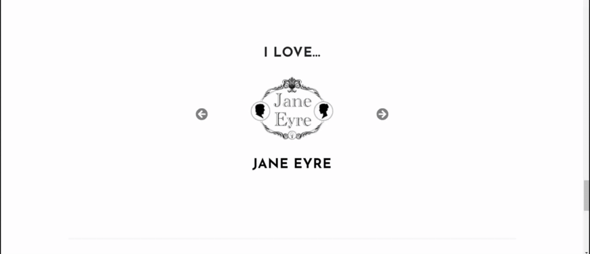 |

- The problem was caused by the following line of CSS code:

    ```
    .carousel-inner {
        overflow: visible;
    }
    ```
    - Removing this line of code completely **fixed** the issue.

    - Changing the code to: `overflow: hidden;` also fixed the issue, but it didn't seem to do anything else beyond that.
       
        - Removing the code was the most efficient solution.

-----

### iOS Safari 

When sharing the website with friends and family members, those who used Safari browser on iOS operating system found:

- None of the site's images would load.

    - After research it was discovered that the problem was linked to the image format: webP
    - Apple have only just added support for webP images for the first time in Safari - for Safari 14 **only**
    - Apple users with a version lower than **Safari 14** would not see the images
        - A iPhone 7 user and an MacBook Air user reported that none of the site's images loaded on their device

- Images were converted back to PNG format to ensure compatability on a wide range of devices

    - This came at a slight performance hit cost - a reason why the images were converted to webP format in the first place.
    - Ensuring functionality on a wide range of devices takes precedence over a small performance boost. 


-----


### Tablet Devices 

When testing on a **Sony Xperia Z4 Tablet** (dimensions: 167 × 254 × 6.1 mm; pixels: 2560 x 1600) in landscape mode, the background for the **callout card** on the **About Me** page was cut off half way, meaning the text flowed outside of the card's background.

- This problem is difficult to address as the visual bug does is not visible when in DevTools. 


-----


### Performance 

On first loading the site, the images can be a little slow to load and sometimes slight stuttering occurs when scrolling down the page. This often stops once the site has had time to load fully. More details were mentioned [here](#page-performance)